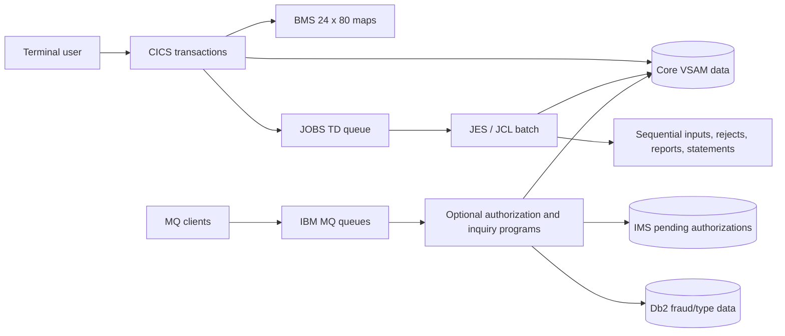
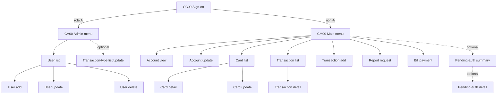
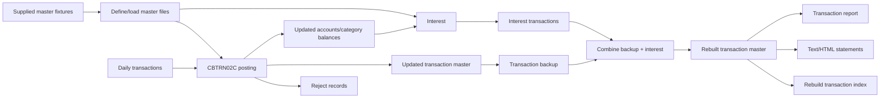
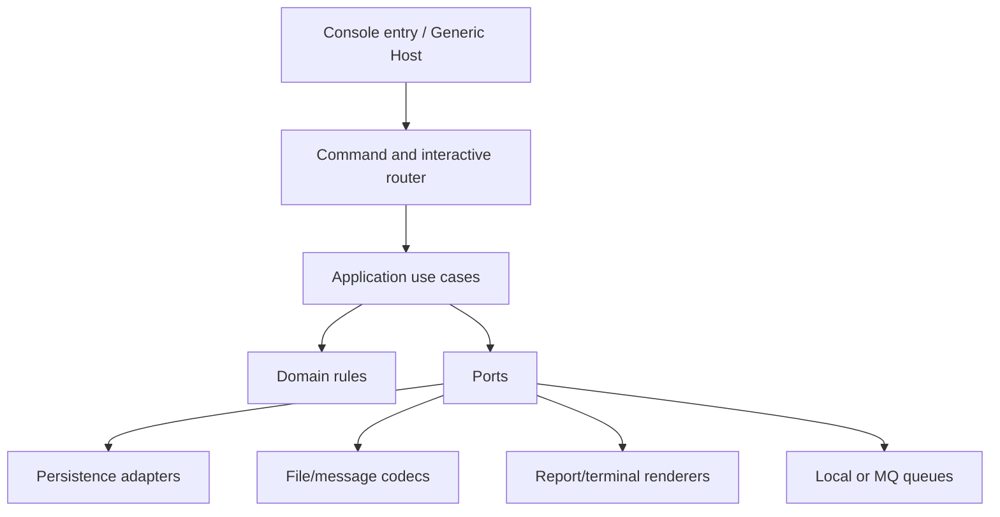

# 2. System context and architecture

[<- Product scope](01-Product-Scope.md) | [Home](Home.md) | [Functional requirements ->](03-Functional-Requirements.md)

## Legacy runtime context

The base product is organized around CICS pseudo-conversational COBOL programs, BMS maps, VSAM files, a transient-data queue for submitting report JCL, and JES batch workloads. Optional packages add Db2, IMS and IBM MQ. This is derived from the executable programs and runtime definitions, including the base [`CARDDEMO.CSD`](../Old_Cobol_Code/app/csd/CARDDEMO.CSD#L1), 55 JCL files, four CSD files, Db2 DDL, IMS DBD/PSB definitions, and MQ calls in the optional programs.

The proposed .NET rebuild shall preserve the behavior and contracts, not these runtime products. The mapping is a target recommendation:

| Legacy mechanism | Behavioral responsibility | .NET 10 console mapping |
|---|---|---|
| CICS transaction + `XCTL` | enter/re-enter one screen controller and route to another | interactive command, explicit route/state machine |
| BMS map | 24x80 labels, fields, attributes, lengths, messages | immutable screen metadata + terminal renderer/view model |
| COMMAREA | session/routing/context values across pseudo-conversations | in-process `SessionContext` scoped to interactive session |
| VSAM KSDS/ESDS/RRDS/AIX | indexed and sequential persistence | repositories over relational default store plus fixture codecs |
| file status / `RESP` | not-found, duplicate, EOF and I/O outcomes | typed result/error objects |
| TDQ `JOBS` + internal reader | queue a report job | durable report-request table/queue and command runner |
| JCL/procedures | allocate inputs/outputs and sequence programs/utilities | validated console subcommands and full-cycle orchestrator |
| scheduler definitions/scripts | calendar/dependency automation | external scheduler invokes stable CLI; application supplies locks/idempotency |
| Db2 | transaction type/category and authorization fraud data | relational entities; optional IBM-compatible adapter if required |
| IMS | pending authorization root/detail hierarchy | relational aggregate with ordered history |
| IBM MQ | request/reply delivery | queue ports, local durable default, optional MQ adapter |

## Base online topology

The useful shared communication area is 160 bytes and carries origin/destination transaction and program, user identity/type, customer/account/card context, and last map/mapset ([`COCOM01Y.cpy`](../Old_Cobol_Code/app/cpy/COCOM01Y.cpy#L19-L44)). On initial invocation a program sends a map; on re-entry it receives input, applies key/field logic, and normally returns through `XCTL`. The replacement should model these states explicitly rather than use padding or program-name strings as control flow.

The transaction-to-program declarations are in [`CARDDEMO.CSD` lines 306-488](../Old_Cobol_Code/app/csd/CARDDEMO.CSD#L306-L488). It also declares an orphan `CDV1` transaction/program `COCRDSEC`, for which no matching source is shipped ([lines 211-218 and 388-397](../Old_Cobol_Code/app/csd/CARDDEMO.CSD#L211-L218)); this is not invented as a product function and is tracked as a [missing artifact](14-Known-Defects-and-Open-Decisions.md#missing-or-orphaned-artifacts).

Every map, field and key is cataloged under [Online Screens](04-Online-Screens-and-Navigation.md#transaction-and-screen-catalog) and [BMS Field Catalog](Appendix-BMS-Field-Catalog.md#catalog).

## Core data architecture

### Online stores

The base CSD declares eight CICS file resources:

| Resource | Role | Access path |
|---|---|---|
| `ACCTDAT` | account master | account key |
| `CARDDAT` | card master | card key |
| `CARDAIX` | card alternate index/path | account-to-card browse |
| `CCXREF` | card/account/customer cross-reference | card key |
| `CXACAIX` | cross-reference alternate index/path | account-to-cross-reference browse |
| `CUSTDAT` | customer master | customer key |
| `TRANSACT` | transaction master | transaction key/browse |
| `USRSEC` | security-user master | user ID |

Evidence: [`CARDDEMO.CSD` lines 1-100](../Old_Cobol_Code/app/csd/CARDDEMO.CSD#L1-L100). The CSD gives all core files `RECOVERY(NONE)` and no update journaling; this explains, but does not justify preserving, partial-update risks. Batch also uses type/category, category-balance, disclosure, daily transaction, reject, report and transfer files that are allocated in JCL rather than defined as online CICS resources.

The logical entities, relationships and mutation rules are in [Domain Data Model](06-Domain-Data-Model.md#logical-relationship-model). Exact byte layouts are in [File and Record Layouts](Appendix-File-and-Record-Layouts.md#layout-index).

### Data-flow invariants

- Card cross-reference is the central resolution path among card, account and customer. Transactions carry a card number, not an account/customer ID.
- Card also duplicates account ID, so the source permits disagreement between card and cross-reference unless a workflow happens to check both.
- Type/category is a composite reference; category is not globally unique.
- Category balance is keyed by account + type + category; disclosure is keyed by group + type + category.
- The same transaction master is written by posting, interest, transaction-add and bill-payment paths. Their validation and account/category-balance side effects are not identical.
- Master-file layouts, transfer layouts, maps and report layouts are distinct contracts and must not be represented by one loosely parsed DTO.

## Batch architecture

The checked-in batch estate combines COBOL programs with IDCAMS, SORT/ICETOOL, IEBGENER, FTP, Db2 utilities and site-specific helpers. The observed high-level core flow is:

Interest reads category balances, accounts, cross-reference data and disclosure rates and writes a new system-transaction generation; it does not consume the rebuilt transaction index ([`INTCALC.jcl` lines 22-41](../Old_Cobol_Code/app/jcl/INTCALC.jcl#L22-L41)). The actual commands, DD data flow, return behavior, scheduler streams and discrepancies are specified in [Batch Processing](05-Batch-Processing.md#batch-workload-catalog). Ordering in a future full-cycle command must be explicit and tested; the existing shell streams and scheduler definitions do not form one contradiction-free canonical schedule.

## Optional architecture boundaries

The three optional source directories are independently packaged and must stay feature-isolated:

| Package | Additional runtime | Core coupling | Source boundary |
|---|---|---|---|
| Transaction type | CICS + Db2 | admin menu and transaction reference data | [`app-transaction-type-db2`](../Old_Cobol_Code/app/app-transaction-type-db2/README.md) |
| Authorization | CICS + IMS + Db2 + MQ | account/card/customer/cross-reference reads; optional main-menu entry | [`app-authorization-ims-db2-mq`](../Old_Cobol_Code/app/app-authorization-ims-db2-mq/README.md) |
| Inquiry/date services | CICS + VSAM + MQ | account reads or system clock only | [`app-vsam-mq`](../Old_Cobol_Code/app/app-vsam-mq/README.md) |

Their protocols, state transitions and known defects are in [Optional Modules and Integrations](07-Optional-Modules-and-Integrations.md#module-boundaries). README/runtime disagreements are recorded rather than resolved by guesswork.

## External interfaces

| Interface | Direction | Contract | Replacement rule |
|---|---|---|---|
| terminal | input/output | BMS field coordinates, lengths, protection/masking, PF keys and message text | interactive 24x80 renderer; textual PF aliases allowed |
| fixed-width files | both | record-specific ASCII/EBCDIC/display/COMP/COMP-3 bytes | named codec per layout, exact length and record-number errors |
| reports/statements | output | fixed 80/100/133-column records and HTML content | strict golden mode plus safe HTML mode by decision |
| report job queue | output/consume | 80-byte JCL records ending with `/*EOF` to `JOBS` TDQ ([`CORPT00C`](../Old_Cobol_Code/app/cbl/CORPT00C.cbl#L462-L531)) | structured report request, never execute raw user JCL |
| authorization message | request/reply | request copybook is fixed-width but code parses comma-delimited fields; reply is comma-delimited | versioned parser with explicit strict/compatible variants |
| MQ inquiry/date | request/reply | fixed offsets and fixed 1000-byte replies | codec plus queue adapter; preserve/pad only in strict mode |
| branch transfer | both | heterogeneous 500-byte records with binary/packed fields | byte-accurate stream codec and transactional importer |

## .NET component and dependency rules

The single deployed console is internally separated so that legacy boundaries remain testable:

Dependency direction is inward: domain code knows no console, EF, SQLite, filesystem, MQ or clock implementation. Interactive and batch entry points call the same use cases when their business operation is the same, while compatibility orchestrators preserve source-specific ordering only where required by tests. Full project and command contracts are in [.NET Target Architecture](09-DotNet-Target-Architecture.md#target-component-model).

## Cross-cutting behavioral constraints

1. Identifiers remain fixed-width strings; leading zeroes are significant.
2. Money calculations use decimal semantics and persisted integer cents; never binary floating point.
3. Time and transaction ID generation are injected and freezeable in tests.
4. Each input codec distinguishes raw bytes from normalized domain values.
5. Safe-mode multi-entity changes are atomic even where CICS/VSAM source can partially update.
6. Strict-parity quirks are named switches, never a general “legacy bugs” mode.
7. Every command returns the stable exit-code contract and is safe under redirected standard streams.
8. Sensitive fields are redacted from logs, terminal errors and batch diagnostics.

## Architecture decisions still requiring approval

- Whether production remains single-node SQLite or selects a server relational provider for concurrent writers.
- Whether IBM MQ wire interoperability is required or the durable local queue is sufficient.
- Which optional modules ship enabled in the first release.
- Whether byte-for-byte report/statement output is required in production or only in characterization tests.
- How each material legacy defect is disposed. See the [decision register](14-Known-Defects-and-Open-Decisions.md#decision-register).

---

[<- Product scope](01-Product-Scope.md) | [Home](Home.md) | [Functional requirements ->](03-Functional-Requirements.md)
