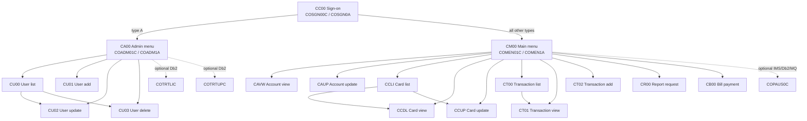

# 4. Online screens and navigation

[Home](Home.md) | [Documentation conventions](Documentation-Conventions.md) | [Batch processing ->](05-Batch-Processing.md)

## Purpose and evidence policy

This page is the implementation contract for the 17 base CICS/BMS screens in the interactive **.NET 10 console application**. It defines the observed routes, field widths, key behavior, validation order, browse state and file mutations. The full physical screen coordinates, colors and BMS attributes remain available in the [BMS named-field catalog](Appendix-BMS-Field-Catalog.md#coactup); persistent byte layouts are defined in [File and Record Layouts](Appendix-File-and-Record-Layouts.md#core-indexed-files); target layering and terminal abstractions are defined in [.NET Target Architecture](09-DotNet-Target-Architecture.md#interactive-terminal-design).

Claims use the labels in [Documentation Conventions](Documentation-Conventions.md#claim-labels):

- **Observed -- code** is a parity fact directly implemented by COBOL/BMS/CSD.
- **Derived** is a deterministic result of cited fields and control flow.
- **Target recommendation** is the safe default for the new console product and is not presented as legacy behavior.
- **Decision required** identifies behavior that cannot be resolved from the supplied source alone.

Program code is authoritative for keys and control flow when a BMS footer disagrees with it. Every map is 24 rows by 80 columns and has a generated input/output symbolic copy under [`app/cpy-bms`](../Old_Cobol_Code/app/cpy-bms/COACTUP.CPY#L1).

## Online topology

**Observed -- code and CSD.** Sign-on routes an `A` user to the administrator menu and every non-`A` user to the main menu ([`COSGN00C.cbl` lines 221-240](../Old_Cobol_Code/app/cbl/COSGN00C.cbl#L221-L240)). The base transaction-to-program bindings are declared in [`CARDDEMO.CSD` lines 306-488](../Old_Cobol_Code/app/csd/CARDDEMO.CSD#L306-L488).



The normal-menu option table contains eleven entries ([`COMEN02Y.cpy` lines 19-98](../Old_Cobol_Code/app/cpy/COMEN02Y.cpy#L19-L98)); the admin table contains six ([`COADM02Y.cpy` lines 19-59](../Old_Cobol_Code/app/cpy/COADM02Y.cpy#L19-L59)). `COPAUS0C`, `COTRTLIC` and `COTRTUPC` are optional-module programs, not additional base screens on this page.

## Transaction and screen catalog

| # | Transaction | Program | Mapset / map | Purpose | Primary source |
|---:|---|---|---|---|---|
| 1 | `CC00` | `COSGN00C` | `COSGN00 / COSGN0A` | Sign on | [`COSGN00C.cbl`](../Old_Cobol_Code/app/cbl/COSGN00C.cbl#L73-L140), [`COSGN00.bms`](../Old_Cobol_Code/app/bms/COSGN00.bms#L19-L205) |
| 2 | `CM00` | `COMEN01C` | `COMEN01 / COMEN1A` | Main menu | [`COMEN01C.cbl`](../Old_Cobol_Code/app/cbl/COMEN01C.cbl#L75-L191), [`COMEN01.bms`](../Old_Cobol_Code/app/bms/COMEN01.bms#L19-L162) |
| 3 | `CA00` | `COADM01C` | `COADM01 / COADM1A` | Admin menu | [`COADM01C.cbl`](../Old_Cobol_Code/app/cbl/COADM01C.cbl#L75-L158), [`COADM01.bms`](../Old_Cobol_Code/app/bms/COADM01.bms#L19-L162) |
| 4 | `CAVW` | `COACTVWC` | `COACTVW / CACTVWA` | View account/customer | [`COACTVWC.cbl`](../Old_Cobol_Code/app/cbl/COACTVWC.cbl#L262-L406), [`COACTVW.bms`](../Old_Cobol_Code/app/bms/COACTVW.bms#L20-L373) |
| 5 | `CAUP` | `COACTUPC` | `COACTUP / CACTUPA` | Update account/customer | [`COACTUPC.cbl`](../Old_Cobol_Code/app/cbl/COACTUPC.cbl#L858-L1037), [`COACTUP.bms`](../Old_Cobol_Code/app/bms/COACTUP.bms#L20-L507) |
| 6 | `CCLI` | `COCRDLIC` | `COCRDLI / CCRDLIA` | List/filter cards | [`COCRDLIC.cbl`](../Old_Cobol_Code/app/cbl/COCRDLIC.cbl#L298-L601), [`COCRDLI.bms`](../Old_Cobol_Code/app/bms/COCRDLI.bms#L20-L339) |
| 7 | `CCDL` | `COCRDSLC` | `COCRDSL / CCRDSLA` | View card | [`COCRDSLC.cbl`](../Old_Cobol_Code/app/cbl/COCRDSLC.cbl#L248-L408), [`COCRDSL.bms`](../Old_Cobol_Code/app/bms/COCRDSL.bms#L20-L152) |
| 8 | `CCUP` | `COCRDUPC` | `COCRDUP / CCRDUPA` | Update card | [`COCRDUPC.cbl`](../Old_Cobol_Code/app/cbl/COCRDUPC.cbl#L388-L543), [`COCRDUP.bms`](../Old_Cobol_Code/app/bms/COCRDUP.bms#L20-L167) |
| 9 | `CT00` | `COTRN00C` | `COTRN00 / COTRN0A` | List transactions | [`COTRN00C.cbl`](../Old_Cobol_Code/app/cbl/COTRN00C.cbl#L95-L219), [`COTRN00.bms`](../Old_Cobol_Code/app/bms/COTRN00.bms#L19-L459) |
| 10 | `CT01` | `COTRN01C` | `COTRN01 / COTRN1A` | View transaction | [`COTRN01C.cbl`](../Old_Cobol_Code/app/cbl/COTRN01C.cbl#L86-L191), [`COTRN01.bms`](../Old_Cobol_Code/app/bms/COTRN01.bms#L19-L268) |
| 11 | `CT02` | `COTRN02C` | `COTRN02 / COTRN2A` | Add transaction | [`COTRN02C.cbl`](../Old_Cobol_Code/app/cbl/COTRN02C.cbl#L107-L188), [`COTRN02.bms`](../Old_Cobol_Code/app/bms/COTRN02.bms#L19-L302) |
| 12 | `CR00` | `CORPT00C` | `CORPT00 / CORPT0A` | Request transaction report | [`CORPT00C.cbl`](../Old_Cobol_Code/app/cbl/CORPT00C.cbl#L163-L202), [`CORPT00.bms`](../Old_Cobol_Code/app/bms/CORPT00.bms#L19-L226) |
| 13 | `CB00` | `COBIL00C` | `COBIL00 / COBIL0A` | Pay full account balance | [`COBIL00C.cbl`](../Old_Cobol_Code/app/cbl/COBIL00C.cbl#L99-L244), [`COBIL00.bms`](../Old_Cobol_Code/app/bms/COBIL00.bms#L19-L135) |
| 14 | `CU00` | `COUSR00C` | `COUSR00 / COUSR0A` | List security users | [`COUSR00C.cbl`](../Old_Cobol_Code/app/cbl/COUSR00C.cbl#L98-L228), [`COUSR00.bms`](../Old_Cobol_Code/app/bms/COUSR00.bms#L19-L458) |
| 15 | `CU01` | `COUSR01C` | `COUSR01 / COUSR1A` | Add security user | [`COUSR01C.cbl`](../Old_Cobol_Code/app/cbl/COUSR01C.cbl#L71-L160), [`COUSR01.bms`](../Old_Cobol_Code/app/bms/COUSR01.bms#L19-L159) |
| 16 | `CU02` | `COUSR02C` | `COUSR02 / COUSR2A` | Update security user | [`COUSR02C.cbl`](../Old_Cobol_Code/app/cbl/COUSR02C.cbl#L82-L245), [`COUSR02.bms`](../Old_Cobol_Code/app/bms/COUSR02.bms#L19-L164) |
| 17 | `CU03` | `COUSR03C` | `COUSR03 / COUSR3A` | Delete security user | [`COUSR03C.cbl`](../Old_Cobol_Code/app/cbl/COUSR03C.cbl#L82-L192), [`COUSR03.bms`](../Old_Cobol_Code/app/bms/COUSR03.bms#L19-L148) |

Generated symbolic-map layouts exist one-for-one for all 17 maps under [`app/cpy-bms`](../Old_Cobol_Code/app/cpy-bms/COACTUP.CPY#L1); they prove COBOL buffer names and widths, while BMS remains authoritative for position and display attributes.

## Common 160-byte COMMAREA and target session

**Observed -- code.** `CARDDEMO-COMMAREA` is exactly 160 display bytes. Its declaration is [`COCOM01Y.cpy` lines 19-44](../Old_Cobol_Code/app/cpy/COCOM01Y.cpy#L19-L44).

| Bytes | Length | COBOL field | Meaning | Target `SessionContext` member |
|---:|---:|---|---|---|
| 1-4 | 4 | `CDEMO-FROM-TRANID` | previous transaction | `PreviousTransaction` |
| 5-12 | 8 | `CDEMO-FROM-PROGRAM` | previous program | `PreviousScreen` / route |
| 13-16 | 4 | `CDEMO-TO-TRANID` | requested transaction | `NextTransaction` |
| 17-24 | 8 | `CDEMO-TO-PROGRAM` | requested program | `NextScreen` / route |
| 25-32 | 8 | `CDEMO-USER-ID` | signed-on ID | `UserId` |
| 33 | 1 | `CDEMO-USER-TYPE` | `A` admin, `U` user | `Role` |
| 34 | 1 | `CDEMO-PGM-CONTEXT` | `0` enter, `1` re-enter | `IsReentry` |
| 35-43 | 9 | `CDEMO-CUST-ID` | current customer | `CustomerId` |
| 44-68 | 25 | `CDEMO-CUST-FNAME` | current first name | `CustomerFirstName` |
| 69-93 | 25 | `CDEMO-CUST-MNAME` | current middle name | `CustomerMiddleName` |
| 94-118 | 25 | `CDEMO-CUST-LNAME` | current last name | `CustomerLastName` |
| 119-129 | 11 | `CDEMO-ACCT-ID` | current account | `AccountId` |
| 130 | 1 | `CDEMO-ACCT-STATUS` | current account status | `AccountStatus` |
| 131-146 | 16 | `CDEMO-CARD-NUM` | current card | `CardNumber` |
| 147-153 | 7 | `CDEMO-LAST-MAP` | prior map | `LastScreenMap` |
| 154-160 | 7 | `CDEMO-LAST-MAPSET` | prior mapset | `LastScreenMapSet` |

**Target recommendation.** Do not serialize or reinterpret these 160 bytes at runtime. Implement a typed, interactive-scope `SessionContext` whose identifiers remain strings so leading zeroes are preserved. Keep authenticated identity and role in trusted application state, not in editable screen data. Store screen-private state separately:

```csharp
internal sealed record SessionContext(
    string UserId,
    UserRole Role,
    ScreenId CurrentScreen,
    ScreenId? PreviousScreen,
    bool IsReentry,
    string? CustomerId,
    string? AccountId,
    string? AccountStatus,
    string? CardNumber,
    string? CustomerFirstName,
    string? CustomerMiddleName,
    string? CustomerLastName);

internal sealed record ListPageState<TId>(
    TId? FirstKey,
    TId? LastKey,
    int PageNumber,
    bool HasNext,
    string? Filter);
```

The COBOL pseudo-conversation pattern is `RETURN TRANSID ... COMMAREA` followed by RECEIVE on re-entry. The console controller instead owns the session until sign-off and dispatches one logical key event at a time. Account/card programs append private state to a work COMMAREA; user/transaction screens append page and selected-row state. That private state maps to screen controller/view-model state, not to the 160-byte common contract.

## Key contract

`CSSTRPFY` maps Enter, Clear, PA1/PA2, PF1-PF12 and aliases PF13-PF24 to PF1-PF12 for account/card programs that include it ([`CSSTRPFY.cpy` lines 17-81](../Old_Cobol_Code/app/cpy/CSSTRPFY.cpy#L17-L81)). Older screens compare raw `EIBAID`; shifted PF aliases are therefore not a universal legacy rule.

| Screen | Enter | F3 | F4 | F5 | F7 | F8 | F12 | Row command / note |
|---|---|---|---|---|---|---|---|---|
| Sign-on | authenticate | thank-you and terminate | -- | -- | -- | -- | -- | other keys invalid |
| Main menu | select option | sign-on/exit | -- | -- | -- | -- | -- | numeric option 1-11 |
| Admin menu | select option | sign-on/exit | -- | -- | -- | -- | -- | numeric option 1-6 |
| Account view | fetch | previous/menu | -- | -- | -- | -- | -- | -- |
| Account update | fetch or validate | previous/menu | -- | save when confirmation state is active | -- | -- | cancel/refetch after fetch | F5/F12 labels are initially dark |
| Card list | search or execute row | menu | -- | -- | previous page | next page | -- | uppercase `S` view, `U` update |
| Card view | fetch | previous/menu | -- | -- | -- | -- | -- | -- |
| Card update | fetch or validate | previous/menu | -- | save when confirmation state is active | -- | -- | cancel/refetch after fetch | hidden day is preserved |
| Transaction list | search or execute row | menu | -- | -- | previous page | next page | -- | `S/s` view |
| Transaction view | fetch | previous/menu | clear | transaction list | -- | -- | -- | -- |
| Transaction add | validate/confirm/add | previous/menu | clear | copy latest transaction data | -- | -- | -- | confirmation `Y/y` or `N/n` |
| Report request | select/confirm/submit | menu | -- | -- | -- | -- | -- | nonblank monthly/yearly/custom marker |
| Bill payment | fetch/confirm/pay | previous/menu | clear | -- | -- | -- | -- | confirmation `Y/y` or `N/n` |
| User list | search or execute row | admin | -- | -- | previous page | next page | -- | `U/u` update, `D/d` delete |
| User add | add | admin | clear | -- | -- | -- | **not implemented** | BMS footer advertises F12, program rejects it |
| User update | fetch | save then return | clear | save | -- | -- | return without save | PF3 navigates even after a save error |
| User delete | fetch | previous/admin | clear | delete | -- | -- | admin | F12 is implemented but not advertised |

**Target recommendation.** `IConsoleTerminal` should expose logical `Enter`, `F3`, `F4`, `F5`, `F7`, `F8`, `F12` events and the textual accessibility aliases specified by [.NET Target Architecture](09-DotNet-Target-Architecture.md#interactive-terminal-design). Unsupported keys return the common invalid-key message from [`CSMSG01Y.cpy` lines 17-21](../Old_Cobol_Code/app/cpy/CSMSG01Y.cpy#L17-L21). A safe controller renders once per key event; it does not reproduce the legacy pattern of sending an error screen and then continuing through the paragraph unless an individually approved strict-compatibility test requires it.

## Field and workflow specifications

Legend: `U` is editable, `P` is displayed/protected, `DARK` is masked, and `state` means protection changes after fetch/validation. Widths are character-cell widths, not .NET storage limits. All screens also contain the common transaction/program/title/date/time header.

### Sign-on

Map evidence: [`COSGN00.bms` lines 75-200](../Old_Cobol_Code/app/bms/COSGN00.bms#L75-L200); symbolic layout: [`COSGN00.CPY`](../Old_Cobol_Code/app/cpy-bms/COSGN00.CPY#L1).

| Field | Width | Mode | Contract |
|---|---:|---|---|
| `APPLID` | 8 | P | CICS application ID |
| `SYSID` | 8 | P | CICS system ID |
| `USERID` | 8 | U | initial cursor |
| `PASSWD` | 8 | U, DARK | masked input |
| `ERRMSG` | 78 | P | validation/authentication result |

Validation is first-error-only: user ID required, then password required; both are uppercased; `USRSEC` is read by uppercased ID; password is compared directly; type `A` routes admin and all other values route main ([`COSGN00C.cbl` lines 108-140 and 209-257](../Old_Cobol_Code/app/cbl/COSGN00C.cbl#L108-L140)). The 80-byte plaintext user record is defined in [`CSUSR01Y.cpy` lines 17-23](../Old_Cobol_Code/app/cpy/CSUSR01Y.cpy#L17-L23).

**Target recommendation.** Preserve the eight-cell input/display contract and route result, but store password hashes, apply a server-side role enum, and never expose stored credential material. Plaintext compatibility is an import concern, not an interactive mode.

### Main and administrator menus

Map evidence: [`COMEN01.bms` lines 75-162](../Old_Cobol_Code/app/bms/COMEN01.bms#L75-L162), [`COADM01.bms` lines 75-162](../Old_Cobol_Code/app/bms/COADM01.bms#L75-L162); symbolic layouts: [`COMEN01.CPY`](../Old_Cobol_Code/app/cpy-bms/COMEN01.CPY#L1), [`COADM01.CPY`](../Old_Cobol_Code/app/cpy-bms/COADM01.CPY#L1).

| Field | Width | Mode | Contract |
|---|---:|---|---|
| `OPTN001`-`OPTN012` | 40 each | P | numbered option text |
| `OPTION` | 2 | U, numeric/right-zero | chosen option |
| `ERRMSG` | 78 | P | validation/install message |

Both programs trim the two-cell input from the right, replace remaining spaces with zeroes, move it to `PIC 9(2)`, then reject nonnumeric, zero or out-of-range values. Main-menu code next applies its role marker check and XCTLs the target ([`COMEN01C.cbl` lines 117-190](../Old_Cobol_Code/app/cbl/COMEN01C.cbl#L117-L190)). Option 11 uses `INQUIRE PROGRAM(COPAUS0C)` and reports “not installed” when absent. Admin dispatch has two “not installed” paths: for a menu slot whose program name is `DUMMY` the `XCTL` is skipped and a “not installed” message is built ([`COADM01C.cbl` lines 140-157](../Old_Cobol_Code/app/cbl/COADM01C.cbl#L140-L158)); for an `XCTL` to a real but uninstalled program it relies on a `PGMIDERR` `HANDLE CONDITION` ([lines 77-79](../Old_Cobol_Code/app/cbl/COADM01C.cbl#L77-L79)) routed to a handler ([lines 270-283](../Old_Cobol_Code/app/cbl/COADM01C.cbl#L270-L283)).

### Account view

Map evidence: [`COACTVW.bms` lines 84-365](../Old_Cobol_Code/app/bms/COACTVW.bms#L84-L365); symbolic layout: [`COACTVW.CPY`](../Old_Cobol_Code/app/cpy-bms/COACTVW.CPY#L1).

| Group | Fields and widths | Mode |
|---|---|---|
| Search | account `ACCTSID(11)` | U |
| Account | status `1`; open/expiry/reissue `10` each; credit/cash/current/cycle-credit/cycle-debit `15` each; group `10` | P |
| Customer identity | customer `9`; SSN display `12`; DOB `10`; FICO `3` | P |
| Names | first/middle/last `25` each | P |
| Address | line 1 `50`; state `2`; line 2 `50`; ZIP `5`; city/address-line-3 `50`; country `3` | P |
| Contact/other | phone 1 `13`; government ID `20`; phone 2 `13`; EFT `10`; primary-holder `1` | P |
| Messages | info `45`; error `78` | P |

Validation requires nonblank, numeric, nonzero account input ([`COACTVWC.cbl` lines 622-683](../Old_Cobol_Code/app/cbl/COACTVWC.cbl#L622-L683)). Read order is `CXACAIX` by account, `ACCTDAT` by account, then `CUSTDAT` by xref customer ([`COACTVWC.cbl` lines 687-870](../Old_Cobol_Code/app/cbl/COACTVWC.cbl#L687-L870)). Output mapping is [`COACTVWC.cbl` lines 460-523](../Old_Cobol_Code/app/cbl/COACTVWC.cbl#L460-L523); address line 3 is labeled City, X(10) ZIP is clipped to five cells, and X(15) phones to thirteen.

### Account update

Map evidence: [`COACTUP.bms` lines 84-507](../Old_Cobol_Code/app/bms/COACTUP.bms#L84-L507); symbolic layout: [`COACTUP.CPY`](../Old_Cobol_Code/app/cpy-bms/COACTUP.CPY#L1).

| Group | Fields and widths | Mode after fetch |
|---|---|---|
| Search/key | account `11` | P after successful fetch |
| Account state | status `1`; open year/month/day `4/2/2`; credit limit `15`; expiry `4/2/2`; cash limit `15`; reissue `4/2/2`; current balance `15`; cycle credit `15`; group `10`; cycle debit `15` | U |
| Customer identity | customer `9`; SSN `3/2/4`; DOB `4/2/2`; FICO `3` | customer P, others U |
| Names | first/middle/last `25` each | U |
| Address | line 1 `50`; state `2`; line 2 `50`; ZIP `5`; city `50`; country `3` | U except country is made P at runtime |
| Contact/other | phone 1 `3/3/4`; government ID `20`; phone 2 `3/3/4`; EFT `10`; primary-holder `1` | U |
| Messages/actions | info `45`; error `78`; F5 label `7`; F12 label `10` | P/state |

Initial account validation is required, numeric and nonzero ([`COACTUPC.cbl` lines 1783-1817](../Old_Cobol_Code/app/cbl/COACTUPC.cbl#L1783-L1817)). After fetch, validation order is normative:

1. status `Y/N`;
2. open date;
3. credit limit;
4. expiry date;
5. cash credit limit;
6. reissue date;
7. current balance;
8. cycle credit;
9. cycle debit;
10. SSN;
11. DOB;
12. FICO;
13. first, middle, last names;
14. address line 1;
15. state;
16. ZIP;
17. city/address line 3;
18. country;
19. phone 1;
20. phone 2;
21. EFT account;
22. primary-holder `Y/N`;
23. state/first-two-ZIP cross-check.

The orchestration is implemented at [`COACTUPC.cbl` lines 1429-1675](../Old_Cobol_Code/app/cbl/COACTUPC.cbl#L1429-L1675). Dates accept only centuries 19/20, validate month/day/leap combinations and call `CSUTLDTC`; DOB must be strictly before today ([`CSUTLDPY.cpy` lines 18-370](../Old_Cobol_Code/app/cpy/CSUTLDPY.cpy#L18-L370), [`CSUTLDTC.cbl` lines 83-153](../Old_Cobol_Code/app/cbl/CSUTLDTC.cbl#L83-L153)). Monetary inputs are mandatory and use `TEST-NUMVAL-C`, without a business range ([`COACTUPC.cbl` lines 2180-2221](../Old_Cobol_Code/app/cbl/COACTUPC.cbl#L2180-L2221)). FICO is 300-850; SSN rejects first part `000`, `666`, and 900-999; state, phone-area and state/ZIP tables are literal copybook values ([`COACTUPC.cbl` lines 2431-2558](../Old_Cobol_Code/app/cbl/COACTUPC.cbl#L2431-L2558), [`CSLKPCDY.cpy` lines 521-930](../Old_Cobol_Code/app/cpy/CSLKPCDY.cpy#L521-L930), [`CSLKPCDY.cpy` lines 1012-1313](../Old_Cobol_Code/app/cpy/CSLKPCDY.cpy#L1012-L1313)). Address line 2, group and government ID have no edits beyond field width.

The state machine is search -> show details -> validate edits -> expose F5 -> save/result; F12 refetches original values ([`COACTUPC.cbl` lines 2562-2643 and 2955-3581](../Old_Cobol_Code/app/cbl/COACTUPC.cbl#L2562-L2643)). Persistence order is account `READ UPDATE`, customer `READ UPDATE`, optimistic comparison with the fetched snapshots, account `REWRITE`, then customer `REWRITE`; only customer rewrite failure explicitly issues rollback ([`COACTUPC.cbl` lines 3888-4193](../Old_Cobol_Code/app/cbl/COACTUPC.cbl#L3888-L4193)).

### Card list

Map evidence: [`COCRDLI.bms` lines 75-334](../Old_Cobol_Code/app/bms/COCRDLI.bms#L75-L334); symbolic layout: [`COCRDLI.CPY`](../Old_Cobol_Code/app/cpy-bms/COCRDLI.CPY#L1).

| Field | Width | Mode |
|---|---:|---|
| page | 3 | P |
| account filter | 11 | U |
| card filter | 16 | U |
| seven selection cells | 1 each | U only for populated rows |
| seven account values | 11 each | P |
| seven card values | 16 each | P |
| seven status values | 1 each | P |
| info / error | 45 / 78 | P |

Each filter is optional; supplied values must be numeric at their fixed width. Both filters combine with AND. Exactly one uppercase row command `S` or `U` is valid ([`COCRDLIC.cbl` lines 951-1119 and 1382-1405](../Old_Cobol_Code/app/cbl/COCRDLIC.cbl#L951-L1119)). The screen browses `CARDDAT` by card key with explicit `GTEQ`, filters in code and takes seven matching rows ([`COCRDLIC.cbl` lines 1123-1377](../Old_Cobol_Code/app/cbl/COCRDLIC.cbl#L1123-L1377)).

### Card view and card update

Map evidence: [`COCRDSL.bms` lines 84-148](../Old_Cobol_Code/app/bms/COCRDSL.bms#L84-L148), [`COCRDUP.bms` lines 84-163](../Old_Cobol_Code/app/bms/COCRDUP.bms#L84-L163); symbolic layouts: [`COCRDSL.CPY`](../Old_Cobol_Code/app/cpy-bms/COCRDSL.CPY#L1), [`COCRDUP.CPY`](../Old_Cobol_Code/app/cpy-bms/COCRDUP.CPY#L1).

| Field | View width/mode | Update width/mode |
|---|---|---|
| account | 11 U | 11 state |
| card | 16 U | 16 state |
| embossed name | 50 P | 50 U after fetch |
| status | 1 P | 1 U after fetch |
| expiry month | 2 P | 2 U after fetch |
| expiry year | 4 P | 4 U after fetch |
| expiry day | not present | 2 DARK/P, preserved |
| info / error | 40 / 80 P | 40 / 80 P |

Both screens require account and card, numeric and nonzero. Both then read `CARDDAT` by card number only; neither compares the record's `CARD-ACCT-ID` with the account entered ([`COCRDSLC.cbl` lines 608-775](../Old_Cobol_Code/app/cbl/COCRDSLC.cbl#L608-L775), [`COCRDUPC.cbl` lines 721-802 and 1376-1415](../Old_Cobol_Code/app/cbl/COCRDUPC.cbl#L721-L802)).

Update validation order is embossed name required and letters/spaces only, uppercase status `Y/N`, expiry month 1-12, expiry year 1950-2099 ([`COCRDUPC.cbl` lines 641-714 and 806-945](../Old_Cobol_Code/app/cbl/COCRDUPC.cbl#L641-L714)). Save rereads with `UPDATE`, compares CVV/name/date/status with the original snapshot, builds a complete 150-byte record and rewrites it ([`COCRDUPC.cbl` lines 1420-1521](../Old_Cobol_Code/app/cbl/COCRDUPC.cbl#L1420-L1521)). No full calendar or “not expired” rule is implemented for the hidden day plus changed month/year.

### Transaction list

Map evidence: [`COTRN00.bms` lines 75-450](../Old_Cobol_Code/app/bms/COTRN00.bms#L75-L450); symbolic layout: [`COTRN00.CPY`](../Old_Cobol_Code/app/cpy-bms/COTRN00.CPY#L1).

| Field | Width | Mode |
|---|---:|---|
| page | 8 | P |
| transaction-ID filter | 16 | U |
| ten selection cells | 1 each | U |
| ten IDs | 16 each | P |
| ten dates | 8 each | P, displayed `MM/DD/YY` |
| ten descriptions | 26 each | P |
| ten amounts | 12 each | P |
| error | 78 | P |

Blank filter starts from low values; supplied ID must be numeric even though the stored field is `X(16)`. The first selected `S/s` row opens transaction view. Rows and pagination are populated at [`COTRN00C.cbl` lines 146-219 and 279-445](../Old_Cobol_Code/app/cbl/COTRN00C.cbl#L146-L219); browse primitives are at [`COTRN00C.cbl` lines 591-695](../Old_Cobol_Code/app/cbl/COTRN00C.cbl#L591-L695).

### Transaction view

Map evidence: [`COTRN01.bms` lines 75-259](../Old_Cobol_Code/app/bms/COTRN01.bms#L75-L259); symbolic layout: [`COTRN01.CPY`](../Old_Cobol_Code/app/cpy-bms/COTRN01.CPY#L1).

| Field | Width | Mode |
|---|---:|---|
| input transaction ID | 16 | U |
| transaction ID / card | 16 / 16 | P |
| type / category / source | 2 / 4 / 10 | P |
| description / amount | 60 / 12 | P |
| origin date / process date | 10 / 10 | P |
| merchant ID / name | 9 / 30 | P |
| merchant city / ZIP | 25 / 10 | P |
| error | 78 | P |

Only nonblank ID is validated. The program performs `READ UPDATE TRANSACT` despite being view-only ([`COTRN01C.cbl` lines 144-191 and 267-295](../Old_Cobol_Code/app/cbl/COTRN01C.cbl#L144-L191)). Display clipping is intentional presentation behavior: description 100->60, merchant name 50->30, city 50->25 and timestamp 26->10.

### Transaction add

Map evidence: [`COTRN02.bms` lines 75-293](../Old_Cobol_Code/app/bms/COTRN02.bms#L75-L293); symbolic layout: [`COTRN02.CPY`](../Old_Cobol_Code/app/cpy-bms/COTRN02.CPY#L1).

| Field | Width | Mode |
|---|---:|---|
| account / card | 11 / 16 | U; account has precedence |
| type / category / source | 2 / 4 / 10 | U |
| description / amount | 60 / 12 | U |
| origin date / process date | 10 / 10 | U, `YYYY-MM-DD` |
| merchant ID / name | 9 / 30 | U |
| merchant city / ZIP | 25 / 10 | U |
| confirmation | 1 | U |
| error | 78 | P |

Key resolution order is account when present -> numeric check -> `CXACAIX` supplies card; otherwise card -> numeric check -> `CCXREF` supplies account; otherwise error ([`COTRN02C.cbl` lines 193-230 and 576-637](../Old_Cobol_Code/app/cbl/COTRN02C.cbl#L193-L230)). If both are present, account wins and the card field is overwritten. `ACCTDAT`/`CARDDAT` status is not checked.

Data validation order is required-field chain (type, category, source, description, amount, origin, process, merchant ID, name, city, ZIP), numeric type, numeric category, exact signed amount `+dddddddd.dd` or `-dddddddd.dd`, structural origin date, structural process date, amount conversion, `CSUTLDTC` origin, `CSUTLDTC` process, numeric merchant ID ([`COTRN02C.cbl` lines 235-437](../Old_Cobol_Code/app/cbl/COTRN02C.cbl#L235-L437)). Nonzero date message `2513` is explicitly ignored. No type/category reference lookup, date ordering or ZIP rule is present.

Add browses to the highest transaction ID, treats it as numeric, adds one, initializes and writes the 350-byte record ([`COTRN02C.cbl` lines 442-466 and 642-749](../Old_Cobol_Code/app/cbl/COTRN02C.cbl#L442-L466)). F5 copies non-key values from that highest record and then runs normal Enter processing ([`COTRN02C.cbl` lines 471-495](../Old_Cobol_Code/app/cbl/COTRN02C.cbl#L471-L495)).

### Report request

Map evidence: [`CORPT00.bms` lines 75-218](../Old_Cobol_Code/app/bms/CORPT00.bms#L75-L218); symbolic layout: [`CORPT00.CPY`](../Old_Cobol_Code/app/cpy-bms/CORPT00.CPY#L1).

| Field | Width | Mode |
|---|---:|---|
| monthly / yearly / custom markers | 1 each | U |
| start month/day/year | 2 / 2 / 4 | U |
| end month/day/year | 2 / 2 / 4 | U |
| confirmation | 1 | U |
| error | 78 | P |

Selector priority is monthly, yearly, custom; any nonblank marker qualifies. Monthly produces the current month's first/last dates; yearly produces January 1/December 31; custom performs required-component, numeric/coarse range and `CSUTLDTC` checks ([`CORPT00C.cbl` lines 212-436](../Old_Cobol_Code/app/cbl/CORPT00C.cbl#L212-L436)). There is no `start <= end` check, and message `2513` is ignored. Confirmation accepts `Y/y`, `N/n` or blank/prompt ([`CORPT00C.cbl` lines 462-510](../Old_Cobol_Code/app/cbl/CORPT00C.cbl#L462-L510)).

The source writes embedded 80-byte JCL to TDQ `JOBS`. It invokes `TRANREPT` through `AWS.M2.CARDDEMO.PROC`, supplies card and processing-date sort symbols and two date parameters ([`CORPT00C.cbl` lines 81-127](../Old_Cobol_Code/app/cbl/CORPT00C.cbl#L81-L127)). The TDQ is an extra-partition `INREADER` queue with fixed 80-byte records ([`CARDDEMO.CSD` lines 499-505](../Old_Cobol_Code/app/csd/CARDDEMO.CSD#L499-L505)). The corresponding batch report behavior is documented in [Batch Processing](05-Batch-Processing.md#transaction-report-cbtrn03c).

**Target recommendation.** Persist one durable `PendingReportRequest` containing report type, normalized start/end dates, actor and request time. `carddemo batch run-pending-reports` consumes it atomically and invokes the target report use case. Keep the visible two-step confirmation and “submitted” result; do not emit z/OS JCL in the self-contained default.

### Bill payment

Map evidence: [`COBIL00.bms` lines 75-127](../Old_Cobol_Code/app/bms/COBIL00.bms#L75-L127); symbolic layout: [`COBIL00.CPY`](../Old_Cobol_Code/app/cpy-bms/COBIL00.CPY#L1).

| Field | Width | Mode |
|---|---:|---|
| account | 11 | U |
| current balance | 14 | P |
| confirmation | 1 | U |
| error | 78 | P |

Source ordering is blank-account check, direct move into numeric account/xref fields, confirmation dispatch, `READ UPDATE ACCTDAT`, positive-balance check, `CXACAIX`, highest-ID browse, transaction write, full-balance subtraction, account rewrite ([`COBIL00C.cbl` lines 154-244](../Old_Cobol_Code/app/cbl/COBIL00C.cbl#L154-L244)). No numeric input check exists before the numeric move.

The generated transaction uses type `02`, category `2`, source `POS TERM`, description `BILL PAYMENT - ONLINE`, amount equal to the complete current balance, the card returned by its single `CXACAIX` read, merchant `999999999 / BILL PAYMENT / N/A / N/A`, and current origin/process timestamps ([`COBIL00C.cbl` lines 208-267](../Old_Cobol_Code/app/cbl/COBIL00C.cbl#L208-L267)). The target data relationship is described in [Domain Data Model](06-Domain-Data-Model.md#online-created-transactions).

### User list

Map evidence: [`COUSR00.bms` lines 75-449](../Old_Cobol_Code/app/bms/COUSR00.bms#L75-L449); symbolic layout: [`COUSR00.CPY`](../Old_Cobol_Code/app/cpy-bms/COUSR00.CPY#L1).

| Field | Width | Mode |
|---|---:|---|
| page | 8 | P |
| user-ID filter | 8 | U |
| ten selection cells | 1 each | U |
| ten user IDs | 8 each | P |
| ten first / last names | 20 / 20 each | P |
| ten user types | 1 each | P |
| error | 78 | P |

Blank search begins at low values; a supplied ID is not normalized or otherwise validated. Rows are scanned top to bottom and the first nonblank `U/u` or `D/d` command routes to update/delete ([`COUSR00C.cbl` lines 151-228](../Old_Cobol_Code/app/cbl/COUSR00C.cbl#L151-L228)). Browse behavior is [`COUSR00C.cbl` lines 237-441 and 586-691](../Old_Cobol_Code/app/cbl/COUSR00C.cbl#L237-L441).

### User add, update and delete

Map evidence: [`COUSR01.bms` lines 75-151](../Old_Cobol_Code/app/bms/COUSR01.bms#L75-L151), [`COUSR02.bms` lines 75-155](../Old_Cobol_Code/app/bms/COUSR02.bms#L75-L155), [`COUSR03.bms` lines 75-140](../Old_Cobol_Code/app/bms/COUSR03.bms#L75-L140); symbolic layouts: [`COUSR01.CPY`](../Old_Cobol_Code/app/cpy-bms/COUSR01.CPY#L1), [`COUSR02.CPY`](../Old_Cobol_Code/app/cpy-bms/COUSR02.CPY#L1), [`COUSR03.CPY`](../Old_Cobol_Code/app/cpy-bms/COUSR03.CPY#L1).

| Field | Add | Update | Delete |
|---|---|---|---|
| search/user ID | `8 U` | `8 U` | `8 U` |
| first name | `20 U` | `20 U` | `20 P` |
| last name | `20 U` | `20 U` | `20 P` |
| password | `8 U,DARK` | `8 U,DARK` | -- |
| user type | `1 U` | `1 U` | `1 P` |
| error | `78 P` | `78 P` | `78 P` |

Add is first-error-only in the exact order first name, last name, ID, password, type, then `WRITE USRSEC` ([`COUSR01C.cbl` lines 117-160 and 238-273](../Old_Cobol_Code/app/cbl/COUSR01C.cbl#L117-L160)). It checks only nonblank values; it does not enforce case, characters, password strength or `A/U`.

Update fetch validates only nonblank ID and reads the record. Save validates ID, first, last, password, type; reads `UPDATE`; compares exact values; rewrites only when modified ([`COUSR02C.cbl` lines 143-245 and 320-389](../Old_Cobol_Code/app/cbl/COUSR02C.cbl#L143-L245)). PF3 invokes save and then returns even when save reported an error ([`COUSR02C.cbl` lines 108-119](../Old_Cobol_Code/app/cbl/COUSR02C.cbl#L108-L119)).

Delete validates only nonblank ID, reads `UPDATE`, and deletes the locked record without a confirmation step, self-delete check or final-admin check ([`COUSR03C.cbl` lines 142-192 and 267-335](../Old_Cobol_Code/app/cbl/COUSR03C.cbl#L142-L192)).

## List pagination contract

**Observed -- code.** Three screens use keyset-like CICS browsing rather than numeric offset paging:

| Screen | Rows | Ordered key | Stored page state | Search positioning |
|---|---:|---|---|---|
| Card list | 7 | card number | first/last card key, page, next flag | explicit `STARTBR ... GTEQ`; app filters account/card |
| Transaction list | 10 | transaction ID | first/last ID, page, next flag | `GTEQ` text is commented out |
| User list | 10 | user ID | first/last ID, page, next flag | `GTEQ` text is commented out |

Forward paging starts at the current last key, reads forward, fills the screen and performs lookahead. Backward paging starts from the first key and reads previous records. Top/bottom conditions return informational messages. Card lookahead examines the next raw record without applying filters, so it can claim another page exists when there is no next matching record.

**Decision required.** The source does not state the deployed CICS default when transaction/user `STARTBR` omits `GTEQ`/`EQUAL` ([`COUSR00C.cbl` lines 586-595](../Old_Cobol_Code/app/cbl/COUSR00C.cbl#L586-L595), [`COTRN00C.cbl` lines 591-600](../Old_Cobol_Code/app/cbl/COTRN00C.cbl#L591-L600)). Characterize the deployed behavior or approve lower-bound semantics; do not infer it from the commented token.

**Target recommendation.** Use deterministic keyset paging with `(filter, firstKey, lastKey, pageNumber, hasNext)`. Query one more **matching** record than the page size, never one unfiltered record. F7/F8 remain the visible commands. A strict test adapter may reproduce the legacy card-list lookahead defect by a named compatibility switch.

## Validation rendering contract

The safe console implementation should preserve source validation priority while avoiding source control-flow defects:

1. Clip/pad raw terminal input to the BMS width before validation.
2. Run validators in the documented source order.
3. Retain per-field invalid flags for color/cursor rendering.
4. Display the first source-priority message when the source uses `WS-RETURN-MSG-OFF` or `EVALUATE TRUE`.
5. Place the cursor on the first invalid field according to the program's attribute-selection order.
6. Perform no read-for-update or mutation until all safe-target validation succeeds.
7. Render exactly once for the key event.

This is a **target recommendation**. In the source, a validation error is displayed by a send-screen paragraph that ends with `EXEC CICS RETURN`, so the task terminates rather than continuing through the paragraph. Strict characterization should instead record where a numeric conversion (`NUMVAL`/`NUMVAL-C`) is applied to non-blank input **before** that value's numeric/range validation completes — notably transaction add and custom report dates — which is the source of the runtime-dependent behavior tracked as [DEC-ONL-004](14-Known-Defects-and-Open-Decisions.md#decision-register).

## Data access and persistence ordering

The physical records and offsets are normative in [File and Record Layouts](Appendix-File-and-Record-Layouts.md#core-indexed-files).

| Program | Reads / browse | Mutation order | Evidence |
|---|---|---|---|
| `COSGN00C` | `USRSEC` | none | [`COSGN00C.cbl` 209-257](../Old_Cobol_Code/app/cbl/COSGN00C.cbl#L209-L257) |
| `COUSR00C` | browse `USRSEC` | none | [`COUSR00C.cbl` 586-691](../Old_Cobol_Code/app/cbl/COUSR00C.cbl#L586-L691) |
| `COUSR01C` | none | `WRITE USRSEC` | [`COUSR01C.cbl` 238-273](../Old_Cobol_Code/app/cbl/COUSR01C.cbl#L238-L273) |
| `COUSR02C` | `READ UPDATE USRSEC` | compare, `REWRITE USRSEC` | [`COUSR02C.cbl` 320-389](../Old_Cobol_Code/app/cbl/COUSR02C.cbl#L320-L389) |
| `COUSR03C` | `READ UPDATE USRSEC` | `DELETE USRSEC` | [`COUSR03C.cbl` 267-335](../Old_Cobol_Code/app/cbl/COUSR03C.cbl#L267-L335) |
| `COACTVWC` | `CXACAIX`, `ACCTDAT`, `CUSTDAT` | none | [`COACTVWC.cbl` 687-870](../Old_Cobol_Code/app/cbl/COACTVWC.cbl#L687-L870) |
| `COACTUPC` | xref/account/customer; reread account/customer update | account rewrite, customer rewrite; rollback only on customer rewrite failure | [`COACTUPC.cbl` 3608-4193](../Old_Cobol_Code/app/cbl/COACTUPC.cbl#L3608-L4193) |
| `COCRDLIC` | browse `CARDDAT` | none | [`COCRDLIC.cbl` 1123-1377](../Old_Cobol_Code/app/cbl/COCRDLIC.cbl#L1123-L1377) |
| `COCRDSLC` | `CARDDAT` by card | none | [`COCRDSLC.cbl` 736-810](../Old_Cobol_Code/app/cbl/COCRDSLC.cbl#L736-L810) |
| `COCRDUPC` | `CARDDAT`, reread update | compare, `REWRITE CARDDAT` | [`COCRDUPC.cbl` 1376-1521](../Old_Cobol_Code/app/cbl/COCRDUPC.cbl#L1376-L1521) |
| `COTRN00C` | browse `TRANSACT` | none | [`COTRN00C.cbl` 591-695](../Old_Cobol_Code/app/cbl/COTRN00C.cbl#L591-L695) |
| `COTRN01C` | `READ UPDATE TRANSACT` | none | [`COTRN01C.cbl` 267-295](../Old_Cobol_Code/app/cbl/COTRN01C.cbl#L267-L295) |
| `COTRN02C` | `CCXREF`/`CXACAIX`, highest `TRANSACT` | `WRITE TRANSACT` | [`COTRN02C.cbl` 442-495 and 576-749](../Old_Cobol_Code/app/cbl/COTRN02C.cbl#L442-L495) |
| `COBIL00C` | `READ UPDATE ACCTDAT`, `CXACAIX`, highest `TRANSACT` | `WRITE TRANSACT`, subtract balance, `REWRITE ACCTDAT` | [`COBIL00C.cbl` 208-235 and 343-547](../Old_Cobol_Code/app/cbl/COBIL00C.cbl#L208-L235) |
| `CORPT00C` | none directly | one `WRITEQ TD JOBS` per JCL line | [`CORPT00C.cbl` 462-535](../Old_Cobol_Code/app/cbl/CORPT00C.cbl#L462-L535) |
| menus | none | none | menu sources above |

The CSD permits read/update/add/delete/browse and declares `RECOVERY(NONE)` with no journaling for the eight base files ([`CARDDEMO.CSD` lines 1-99](../Old_Cobol_Code/app/csd/CARDDEMO.CSD#L1-L99)).

**Target recommendation.** Apply the safe transaction boundaries already defined in [.NET Target Architecture](09-DotNet-Target-Architecture.md#units-of-work): account+customer together, verified card update, validated transaction insert, payment transaction+account balance together, and durable report request as one unit. Use optimistic concurrency tokens rather than retaining database locks across screen interactions.

## Source-observed defects and safe-target decisions

These are executable-source findings, not proposed business rules.

| Source-observed issue | Exact evidence | Exact-parity implication | Safe-target decision |
|---|---|---|---|
| Account update output omits account ZIP, shifts group into bytes 103-112 and blanks true group | update layout [`COACTUPC.cbl` 418-433](../Old_Cobol_Code/app/cbl/COACTUPC.cbl#L418-L433) vs canonical [`CVACT01Y.cpy` 4-17](../Old_Cobol_Code/app/cpy/CVACT01Y.cpy#L4-L17) | Characterization fixture should expose the byte shift | Never reproduce in production; map named domain fields correctly. A named strict codec test may model it. |
| Account/customer ZIP X(10) is displayed/rewritten through X(5) | [`COACTUP.bms` 378-385](../Old_Cobol_Code/app/bms/COACTUP.bms#L378-L385), [`CVCUS01Y.cpy` 12-16](../Old_Cobol_Code/app/cpy/CVCUS01Y.cpy#L12-L16) | Screen accepts only five characters | Keep five-cell legacy presentation if required, but preserve all ten stored characters unless the user explicitly replaces the full value. |
| Card update “new CVV” is defined/used but never assigned | definitions/use [`COCRDUPC.cbl` 294-317 and 1461-1465](../Old_Cobol_Code/app/cbl/COCRDUPC.cbl#L294-L317); old-only assignment [`COCRDUPC.cbl` 1343-1367](../Old_Cobol_Code/app/cbl/COCRDUPC.cbl#L1343-L1367) | Save can corrupt/abend depending on runtime numeric handling | Preserve original CVV and never display/log it. |
| Card view/update ignore entered account after validating it | [`COCRDSLC.cbl` 736-775](../Old_Cobol_Code/app/cbl/COCRDSLC.cbl#L736-L775), [`COCRDUPC.cbl` 1376-1415](../Old_Cobol_Code/app/cbl/COCRDUPC.cbl#L1376-L1415) | A card can be shown/updated with an unrelated account value | Require `card.AccountId == enteredAccountId`; return not found/mismatch without disclosure. |
| Account/customer NOTFND 88-level flags are tested but their SET statements are commented | view [`COACTVWC.cbl` 704-715, 786-843](../Old_Cobol_Code/app/cbl/COACTVWC.cbl#L704-L715); update [`COACTUPC.cbl` 3624-3638, 3713-3769](../Old_Cobol_Code/app/cbl/COACTUPC.cbl#L3624-L3638) | Flow may continue with zero/stale buffers | Stop immediately on each failed repository lookup. |
| Account view maps account data if account **or customer** is found | [`COACTVWC.cbl` 471-491](../Old_Cobol_Code/app/cbl/COACTVWC.cbl#L471-L491) | Partial/stale account display is possible | Render account fields only from a successful account result. |
| Transaction-add confirmation `EVALUATE` is not wrapped in an explicit `IF NOT ERR-FLG-ON`; instead every validation error runs `SEND-TRNADD-SCREEN`, which issues `EXEC CICS RETURN` and ends the task before confirmation is evaluated | validation [`COTRN02C.cbl` 164-188](../Old_Cobol_Code/app/cbl/COTRN02C.cbl#L164-L188), send/return [`COTRN02C.cbl` 516-534](../Old_Cobol_Code/app/cbl/COTRN02C.cbl#L516-L534) | Invalid data does not reach `ADD-TRANSACTION`; the gate relies on control-flow termination, not an explicit flag test | Gate mutation on an explicit validated-state check; do not rely on send-then-return to enforce validation. |
| Bill payment continues after xref/browse/write errors | [`COBIL00C.cbl` 208-235](../Old_Cobol_Code/app/cbl/COBIL00C.cbl#L208-L235) | Transaction and balance can diverge | One atomic unit of work; rollback all on any failure. |
| Transaction IDs use highest ID + 1 without serialization | [`COTRN02C.cbl` 442-466](../Old_Cobol_Code/app/cbl/COTRN02C.cbl#L442-L466), [`COBIL00C.cbl` 212-219](../Old_Cobol_Code/app/cbl/COBIL00C.cbl#L212-L219) | Concurrent adds can collide | Allocate IDs through an atomic sequence/service while retaining 16-character formatting. |
| Custom report converts each date component with `NUMVAL-C` (lines 305-327) **before** its numeric/range checks (lines 329+); a blank component instead runs `SEND-TRNRPT-SCREEN` → `EXEC CICS RETURN` and never reaches the conversion | conversion/branch [`CORPT00C.cbl` 258-327](../Old_Cobol_Code/app/cbl/CORPT00C.cbl#L258-L327), send/return [`CORPT00C.cbl` 556-591](../Old_Cobol_Code/app/cbl/CORPT00C.cbl#L556-L591) | Non-blank malformed text reaches `NUMVAL-C` before validation, so the result is runtime-dependent | Validate numeric/format before conversion; also enforce start ≤ end. |
| Report writes `/*EOF` and can leave a partial TDQ job | [`CORPT00C.cbl` 496-508](../Old_Cobol_Code/app/cbl/CORPT00C.cbl#L496-L508) | Strict output includes final marker; partial queue writes possible | Store one atomic report request, not linewise JCL. |
| Phone optional-check references part A where part C was intended | [`COACTUPC.cbl` 2232-2241](../Old_Cobol_Code/app/cbl/COACTUPC.cbl#L2232-L2241) | Some partial phone inputs can be treated as blank | Validate all three parts explicitly. |
| Card hidden day is retained while month/year change without full-date validation | [`COCRDUPC.cbl` 673-708 and 1467-1475](../Old_Cobol_Code/app/cbl/COCRDUPC.cbl#L673-L708) | Invalid calendar expiry can be stored | Validate the complete retained date before save. |
| User add/update accepts any nonblank type and preserves case while sign-on uppercases credentials | [`COUSR01C.cbl` 117-159](../Old_Cobol_Code/app/cbl/COUSR01C.cbl#L117-L159), [`COSGN00C.cbl` 132-136](../Old_Cobol_Code/app/cbl/COSGN00C.cbl#L132-L136) | Lowercase credentials may be unusable; arbitrary roles route non-admin | Enforce role enum and secure credential normalization/hash policy. |
| User update PF3 returns after a failed save attempt | [`COUSR02C.cbl` 108-119](../Old_Cobol_Code/app/cbl/COUSR02C.cbl#L108-L119) | Error can be hidden by navigation | Remain on update screen unless save succeeds; F12 is explicit cancel. |
| User delete has no confirmation, self-delete or final-admin protection | [`COUSR03C.cbl` 174-192](../Old_Cobol_Code/app/cbl/COUSR03C.cbl#L174-L192) | Immediate F5 deletion | Require confirmation and preserve at least one administrator. |
| Card next-page lookahead is not filter-aware | [`COCRDLIC.cbl` 1191-1231](../Old_Cobol_Code/app/cbl/COCRDLIC.cbl#L1191-L1231) | F8 can lead to an empty page | Determine `HasNext` from the next matching record. |

Security weaknesses such as plaintext passwords and mutable COMMAREA roles are never enabled by a compatibility profile. Other quirks, if needed for migration comparison, must be individually named and tested as described in [.NET Target Architecture](09-DotNet-Target-Architecture.md#compatibility-profiles).

## Unresolved runtime and integration decisions

- **Decision required -- non-unique alternate indexes.** `CXACAIX` is an account-key alternate path over card cross-reference and can contain more than one card for an account. Account view/update, transaction add and bill payment issue one `READ` and contain no tie-break rule ([`COACTVWC.cbl` lines 723-771](../Old_Cobol_Code/app/cbl/COACTVWC.cbl#L723-L771), [`COTRN02C.cbl` lines 576-637](../Old_Cobol_Code/app/cbl/COTRN02C.cbl#L576-L637), [`COBIL00C.cbl` lines 408-436](../Old_Cobol_Code/app/cbl/COBIL00C.cbl#L408-L436)). Do not claim lowest, highest or “primary” card selection without runtime characterization. The safe target should require an explicit card where the operation affects a card-bound transaction, or adopt an approved deterministic rule.
- **Decision required -- CEEDAYS message 2513.** Transaction add and report request ignore this nonzero message, but its meaning is not defined in the repository. Preserve the observed branch in characterization; approve an explicit .NET date-range rule for production.
- **Decision required -- missing base implementation.** `COCRDSEC` and transaction `CDV1` are declared in [`CARDDEMO.CSD` lines 211-218](../Old_Cobol_Code/app/csd/CARDDEMO.CSD#L211-L218) and [`CARDDEMO.CSD` lines 388-398](../Old_Cobol_Code/app/csd/CARDDEMO.CSD#L388-L398), but no corresponding source/map exists. It is not one of the 17 implementable base screens.
- **Decision required -- external execution.** `CEEDAYS` and the `TRANREPT` procedure are external to this source tree. The safe target uses typed date parsing and the batch report use case; any interoperability mode needs a separately supplied contract.
- **Decision required -- malformed numeric data.** Several COBOL paths move display text to numeric fields before all validation. The source proves the ordering, but compiler/runtime settings determine whether a particular malformed value raises a data exception. Such cases require characterization rather than an invented error message.

## Implementation acceptance checklist

- All 17 `ScreenId` values have immutable 24x80 metadata, a view model, a controller and virtual-terminal golden snapshots.
- Every business field above clips/pads to its BMS width and masks `DARK` values.
- The actual-key table, including unadvertised/incorrect footer behavior, has controller tests.
- `SessionContext` preserves leading-zero identifiers and previous-route behavior without trusting screen-supplied role data.
- Validation tests assert source order, first visible message and cursor/field flags.
- List tests cover first page, exact/lower-bound search decision, F7/F8, empty files, last page, filters and concurrent record changes.
- Repository integration tests assert the read/mutation ordering table in strict characterization and the safe atomic boundaries in production mode.
- Fault-injection tests prove transaction add, account/card update, bill payment and report request leave no partial safe-mode mutation.
- Sensitive fields (password, CVV, SSN, government ID and EFT ID) are absent from logs and exception text, consistent with [.NET logging requirements](09-DotNet-Target-Architecture.md#logging-audit-and-observability).
- Source gaps (`COCRDSEC`, external `CEEDAYS`, `TRANREPT`, optional programs and runtime `STARTBR` default) are not replaced with invented behavior.

---

[Home](Home.md) | [Documentation conventions](Documentation-Conventions.md) | [Batch processing ->](05-Batch-Processing.md)
