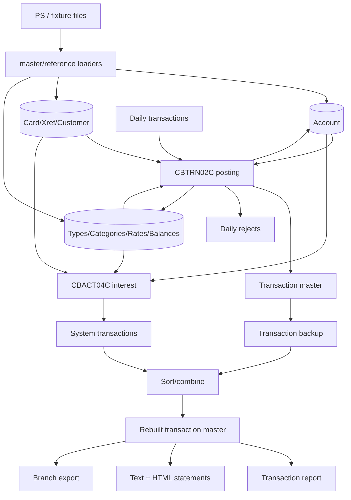

# 5. Batch processing specification

[← Online screens](04-Online-Screens-and-Navigation.md) · [Home](Home.md) · [Domain data model →](06-Domain-Data-Model.md)

## Batch workload catalog

The core `app/jcl` directory contains 38 jobs. “Product” means the job participates in a documented application lifecycle; “support/demo” means it exercises a platform feature or diagnostic path; “stale/inconsistent” means it is inventoried but cannot define current behavior without a decision.

| Job | Class | Observed function | .NET 10 console mapping |
|---|---|---|---|
| `ACCTFILE` | Product load | Delete/define/load 300-byte account KSDS | `database initialize` / `batch refresh-masters` |
| `CARDFILE` | Product load | Close card resources; delete/define/load card KSDS; create account AIX/path; build index; reopen | same |
| `CBADMCDJ` | Stale/inconsistent | Older DFHCSDUP resource set with names not matching shipped maps/programs | no runtime command; migration evidence only |
| `CBEXPORT` | Product transfer | Define 500-byte export KSDS and run `CBEXPORT` | `transfer export-branch` |
| `CBIMPORT` | Product transfer, broken JCL | Run `CBIMPORT`; required `CARDOUT` DD is absent | `transfer import-branch` with all outputs |
| `CLOSEFIL` | Product operations | SDSF operator commands close `TRANSACT`, `CCXREF`, `ACCTDAT`, `CXACAIX`, `USRSEC` | batch lock acquisition replaces CICS close |
| `COMBTRAN` | Product cycle | Sort backup + system transactions by ID, then load transaction master | `batch combine-transactions` |
| `CREASTMT` | Product reporting, malformed JCL | Re-key transaction work file by card+ID; generate text/HTML statements | `batch generate-statements` |
| `CUSTFILE` | Product load | Close, delete/define/load, reopen customer KSDS | `batch refresh-masters` |
| `DALYREJS` | Product setup | Define daily-reject GDG base | initialized by database/file setup |
| `DEFCUST` | Stale/inconsistent | Obsolete standalone customer cluster definition with duplicated step/name/key conflicts | excluded pending decision |
| `DEFGDGB` | Product setup | Define application GDG bases | create archive/run retention structure |
| `DEFGDGD` | Optional setup | Define/copy additional transaction-type/category GDGs | optional reference-data setup |
| `DISCGRP` | Product load | Delete/define/load disclosure-rate KSDS | `batch refresh-masters` |
| `DUSRSECJ` | Product load | Build plaintext security PS, define/load user KSDS | seed/migrate users; never retain plaintext target storage |
| `ESDSRRDS` | Support/demo | Build user-security data in ESDS and RRDS forms | codec/import tests only |
| `FTPJCL` | Support/demo, insecure | FTP a mainframe file with embedded host/user/password | no default command; secure transfer adapter only if required |
| `INTCALC` | Product cycle | Run `CBACT04C` with hard-coded ten-character parameter | `batch calculate-interest --cycle-id ...` |
| `INTRDRJ1` | Support/demo | Copy FTP data then submit `INTRDRJ2` through internal reader | scheduler demonstration; no product rule |
| `INTRDRJ2` | Support/demo | Copy the backup to a second data set | scheduler demonstration |
| `OPENFIL` | Product operations | SDSF operator commands reopen core CICS files | release batch lock |
| `POSTTRAN` | Product cycle | Run `CBTRN02C` against daily input, master/account/xref/category files and reject GDG | `batch post-transactions` |
| `PRTCATBL` | Support/report | Repro category balances and sort by composite key | diagnostic export/report |
| `READACCT` | Support/data-format demo | Run `CBACT01C`; print accounts and create mixed/array/variable records | codec characterization command/tests |
| `READCARD` | Support/diagnostic | Run `CBACT02C` to sequentially print cards | `database verify --entity cards` |
| `READCUST` | Support/diagnostic | Run `CBCUS01C` to sequentially print customers | `database verify --entity customers` |
| `READXREF` | Support/diagnostic | Run `CBACT03C` to sequentially print xrefs | `database verify --entity xrefs` |
| `REPTFILE` | Product setup, conflicting | Define transaction-report GDG with retention different from `DEFGDGB` | configurable retention; decision required |
| `TCATBALF` | Product load | Delete/define/load category-balance KSDS | `batch refresh-masters` |
| `TRANBKP` | Product cycle | Repro transaction master to GDG, delete/redefine an empty master | snapshot/archive operation |
| `TRANCATG` | Product load | Delete/define/load transaction-category KSDS | `batch refresh-masters` |
| `TRANFILE` | Product load | Close/delete/define/load transaction master; create timestamp AIX/path; reopen | initialization/import |
| `TRANIDX` | Product cycle | Create/build transaction processing-timestamp AIX/path | relational index migration/verification |
| `TRANREPT` | Product reporting | Repro/filter/sort by card; execute `CBTRN03C` | `batch generate-report` |
| `TRANTYPE` | Product load | Delete/define/load transaction-type KSDS | `batch refresh-masters` |
| `TXT2PDF1` | Optional external utility | Invoke absent TXT2PDF libraries/REXX against text statement | optional document-render adapter |
| `WAITSTEP` | Support/scheduling | Call `COBSWAIT`/`MVSWAIT` with delay parameter | scheduler wait/backoff, not a business rule |
| `XREFFILE` | Product load | Delete/define/load xref KSDS; create account AIX/path; build index | `batch refresh-masters` |

The JCL evidence is individually inventoried in [Source Inventory](Appendix-Source-Inventory.md); program and job links are in [Program Catalog](Appendix-Program-Catalog.md#batch-and-utility-programs).

## Batch data lineage



Primary orchestration evidence: [`POSTTRAN.jcl` lines 23–42](../Old_Cobol_Code/app/jcl/POSTTRAN.jcl#L23-L42), [`INTCALC.jcl` lines 22–41](../Old_Cobol_Code/app/jcl/INTCALC.jcl#L22-L41), [`TRANBKP.jcl` lines 21–67](../Old_Cobol_Code/app/jcl/TRANBKP.jcl#L21-L67), and [`COMBTRAN.jcl` lines 22–48](../Old_Cobol_Code/app/jcl/COMBTRAN.jcl#L22-L48).

## Posting: `CBTRN02C`

### Inputs and modes

| Assignment | Mode | Record/store |
|---|---|---|
| `DALYTRAN` | sequential input | 350-byte daily transaction |
| `TRANFILE` | indexed output | 350-byte transaction master; expected empty/recreated |
| `XREFFILE` | indexed input | card xref by card |
| `DALYREJS` | sequential output | 430-byte original+reason |
| `ACCTFILE` | indexed I/O | account master |
| `TCATBALF` | indexed I/O | composite category balance |

Evidence: [`CBTRN02C.cbl` lines 28–97](../Old_Cobol_Code/app/cbl/CBTRN02C.cbl#L28-L97).

### Validation order and rejects

For each daily record:

1. Resolve card in xref; missing → `0100`, reason text `INVALID CARD NUMBER FOUND` (no trailing period in the stored literal).
2. Resolve account; missing → `0101`, reason text `ACCOUNT RECORD NOT FOUND`.
3. Calculate `cycle credit - cycle debit + incoming amount`; if above credit limit → `0102`, “OVERLIMIT TRANSACTION.”
4. Lexically compare account expiration text with the first ten original-timestamp characters; expired → `0103`, “TRANSACTION RECEIVED AFTER ACCT EXPIRATION.”

Evidence: [`CBTRN02C.cbl` lines 370–421](../Old_Cobol_Code/app/cbl/CBTRN02C.cbl#L370-L421). Expiration runs after limit and overwrites `0102` with `0103` when both fail.

No code validates account/card active flags, card expiry, customer, type/category existence, duplicate transaction ID, amount sign/range, merchant fields, or timestamp syntax. The source leaves an explicit “ADD MORE VALIDATIONS HERE” placeholder. The safe-target additions must be approved deviations, never presented as legacy rules.

### Accepted-record mutation

The program maps all daily fields into the master, generates processing timestamp `yyyy-MM-dd-HH.mm.ss.cc0000`, then performs:

1. category-balance create or increment;
2. account current/cycle balance rewrite;
3. transaction write.

Positive amounts add to cycle credit; negative amounts are added as negative values to cycle debit ([`CBTRN02C.cbl` lines 424–442 and 467–579](../Old_Cobol_Code/app/cbl/CBTRN02C.cbl#L424-L442)). These steps are non-atomic. A later failure does not undo an earlier mutation; account rewrite reason 109 is set after validation and the transaction write still follows.

### Completion

All records continue after business rejects. Final return code is 4 if reject count is nonzero; file failures display the two-byte status and call `CEE3ABD` with abend code 999 ([`CBTRN02C.cbl` lines 227–231 and 707–727](../Old_Cobol_Code/app/cbl/CBTRN02C.cbl#L227-L231)).

## Interest: `CBACT04C`

The input must be ordered by category-balance composite key. On each account change the program applies the previous account’s accumulated interest, reads the new account, obtains one xref by non-unique account alternate key, and looks up disclosure rate `(account.group, type, category)`. Status 23 retries with group `DEFAULT` ([`CBACT04C.cbl` lines 188–221 and 393–460](../Old_Cobol_Code/app/cbl/CBACT04C.cbl#L188-L221)).

For every nonzero rate:

```text
monthly interest = category balance × annual rate ÷ 1200
```

No `ROUNDED` is used; assignment to a two-decimal receiver truncates excess fraction. One transaction is written per qualifying category with type `01`, category `0005`, source `System`, description `Int. for a/c <account>`, card from the selected xref, amount equal to category interest, and both timestamps set to now. Transaction ID is the exact ten-byte external parameter plus a global six-digit suffix ([`CBACT04C.cbl` lines 462–515](../Old_Cobol_Code/app/cbl/CBACT04C.cbl#L462-L515)).

When an account is applied, total interest is added to current balance and both cycle accumulators are reset. Fees are an empty no-op paragraph. The EOF control flow never applies the final account although its interest transactions have been written; see [Interest final-account update](14-Known-Defects-and-Open-Decisions.md#interest-final-account-update).

Other strict facts:

- one of multiple xrefs/cards is selected nondeterministically by a non-unique alternate-key read;
- interest transactions do not create category-balance rows;
- `INTCALC.jcl` hard-codes `2022071800`;
- its `XREFFIL1` AIX DD is not the COBOL `XREFFILE` assignment and actual runtime binding is unresolved.

## Transaction report: `CBTRN03C`

`TRANREPT.jcl` first repros a transaction generation, filters/sorts it by card, then runs the report program. The JCL filter is hard-coded to processing dates `2022-01-01` through `2022-07-06` ([`TRANREPT.jcl` lines 23–55](../Old_Cobol_Code/app/jcl/TRANREPT.jcl#L23-L55)). The program independently reads a data set named `DATEPARM` containing start date, one separator, and end date; its DD is supplied by `TRANREPT.jcl`/`.prc` ([`TRANREPT.jcl` DATEPARM DD lines 73–74](../Old_Cobol_Code/app/jcl/TRANREPT.jcl#L73-L74)), but the referenced dataset content is not checked into the repository ([`CBTRN03C.cbl` lines 87–125 and 219–243](../Old_Cobol_Code/app/cbl/CBTRN03C.cbl#L87-L125)).

For each in-range transaction it resolves account through xref, type description, and composite category description, then writes a 133-character detail line. It emits page totals every 20 line-counter units, “account” totals on card change, and a grand total ([`CBTRN03C.cbl` lines 274–373](../Old_Cobol_Code/app/cbl/CBTRN03C.cbl#L274-L373)).

Strict control-flow quirks:

- out-of-range `NEXT SENTENCE` targets the period after the loop and can end processing rather than skip only that row;
- EOF reuses/adds the final amount again, writes page/grand totals and omits the final card/account total;
- “Account Total” groups by card number;
- missing xref/type/category is fatal;
- same-card order is undefined because the sort key is card only;
- JCL and `DATEPARM` ranges can disagree.

The safe-target report must fix these and retain a `StrictLegacy` golden formatter only for comparison.

## Statements: `CBSTM03A` and `CBSTM03B`

`CREASTMT` sorts transactions by card then ID, moves card to the front, and loads a temporary 32-byte-key KSDS ([`CREASTMT.JCL` lines 22–61](../Old_Cobol_Code/app/jcl/CREASTMT.JCL#L22-L61)). Its `OUTREC` drops the last two processing-timestamp bytes and original filler, replacing the final 22 bytes with padding.

`CBSTM03A` uses z/OS PSA/TCB/TIOT address structures, `ALTER`/`GO TO`, and the `CBSTM03B` DD-name dispatcher to open/read four files. It loads transactions into a fixed table of **51 cards × 10 transactions**, scans every xref, reads customer/account, and produces a text and HTML statement even when the card has no transactions ([`CBSTM03A.CBL` lines 225–315 and 416–504](../Old_Cobol_Code/app/cbl/CBSTM03A.CBL#L225-L315)). Input transactions and xrefs must be ascending by card for early-stop matching.

Text output includes customer name/address, account ID, current balance, FICO, transactions, signed `Total EXP`, and markers. HTML emits a separate complete document per xref into one concatenated file, omits total amount, does not HTML-escape data, and does not check output write status. `CBSTM03B` implements open/read/read-key/close; declared write/rewrite operations are not implemented ([`CBSTM03B.CBL` lines 99–229](../Old_Cobol_Code/app/cbl/CBSTM03B.CBL#L99-L229)).

The JCL contains malformed text on the output `SPACE` line and a delete-step HTML LRECL 80 versus final LRECL 100. Target statements have no fixed 51×10 cap, escape HTML, create one valid document (or explicit per-card files), and report write failures.

## Branch export and import

### Export

`CBEXPORT` reads every customer, account, xref, transaction, then card, assigning one common timestamp and monotonically increasing global sequence. It does **not** filter by branch; every row is labeled branch `0001`, region `NORTH` ([`CBEXPORT.cbl` lines 149–195 and 243–551](../Old_Cobol_Code/app/cbl/CBEXPORT.cbl#L149-L195)). Only 22 timestamp characters are explicitly constructed into the 26-character field; the tail is not explicitly assigned.

Inputs are shared and there is no snapshot/locking, so cross-file output need not be consistent. Mixed binary/packed payload is specified in [Branch export layout](Appendix-File-and-Record-Layouts.md#branch-exportimport-record--500-bytes). The JCL key offset is one byte later than the actual sequence field.

### Import

`CBIMPORT` dispatches record types `C/A/X/T/D` into sequential outputs. It does not validate checksum, reference integrity, sequence, timestamp, branch, region, duplicates, fields or counts. Unknown types produce a 132-byte error output and processing continues with return code 0; `3000-VALIDATE-IMPORT` always announces no validation errors ([`CBIMPORT.cbl` lines 248–452](../Old_Cobol_Code/app/cbl/CBIMPORT.cbl#L248-L452)).

The error group is 130 bytes moved to a 132-byte record, and displays only seven sequence digits. `CBIMPORT.jcl` omits `CARDOUT`, so current JCL fails while opening card output after prior outputs may already exist. The target command makes all outputs explicit and returns 4 when any unknown/invalid row exists.

## Diagnostic and format-demonstration programs

`CBACT02C`, `CBACT03C` and `CBCUS01C` sequentially read and display card, xref and customer masters. `CBTRN01C` is labeled posting but only displays daily records and verifies xref/account; customer/card/transaction files are opened and never read. Its lookup runs once more with retained daily data at EOF because the lookup is outside the EOF guard ([`CBTRN01C.cbl` lines 154–250](../Old_Cobol_Code/app/cbl/CBTRN01C.cbl#L154-L250)). It is a prototype/diagnostic, not a second posting engine.

`CBACT01C` is an intentional data-format exercise. Per account it:

- writes a shortened transformed account with cycle debit in `COMP-3`, changes zero debit to `2525.00`, converts reissue date through assembler `COBDATFT`, and omits ZIP;
- writes an array record with five occurrences but populates only three, including constants;
- writes two variable records of lengths 12 and 39;
- opens three output files but its main flow explicitly closes only the account input.

Evidence: [`CBACT01C.cbl` lines 50–85 and 140–315](../Old_Cobol_Code/app/cbl/CBACT01C.cbl#L50-L85). These transformations are codec/test features, not account business updates.

`ESDSRRDS.jcl`, FTP/internal-reader jobs, and TXT2PDF demonstrate platform integration. They belong in compatibility tests or optional adapters, not the core financial cycle.

## Deterministic fixture oracle

The supplied ASCII fixture is an executable acceptance baseline after applying the current copybook offsets and exact COBOL posting arithmetic.

### Input integrity

- 50 accounts, cards, xrefs, customers and initial category-balance rows.
- 300 daily transactions: 250 type/category `01/0001`, 50 `03/0001`.
- 250 positive and 50 negative amounts; total `104,801.54`.
- All daily cards and reference type/categories resolve.
- Initial account balance sum `12,269.00`; cycle balances and category balances are zero.
- All account group fields parse blank; `A000000000` occupies ZIP.

### Strict posting result

| Measure | Expected |
|---|---:|
| processed | 300 |
| accepted | 262 |
| rejected | 38 |
| reject reasons | all `0102` |
| accepted amount | 77,954.70 |
| accepted positive / cycle credit | 102,353.99 |
| accepted negative / cycle debit | -24,399.29 |
| rejected amount | 26,846.84 |
| final account-balance sum | 90,223.70 |
| transaction rows | 262 |
| category-balance rows | 100 |
| process exit/return code | 4 |

Representative account vectors:

| Account | Accepted | Rejected | Purchase balance | Credit balance | Posted current balance |
|---|---:|---:|---:|---:|---:|
| `00000000001` | 4 | 2 | 1,164.87 | -70.77 | 1,288.10 |
| `00000000017` | 2 | 4 | 343.77 | -998.33 | -621.56 |
| `00000000030` | 2 | 4 | 29.44 | -930.33 | -898.89 |
| `00000000037` | 1 | 5 | 0.00 | -132.88 | -125.88 |
| `00000000050` | 6 | 0 | 1,501.75 | -47.88 | 1,945.87 |

### Strict interest result after posting

With cycle ID `2022071800`, blank groups use `DEFAULT/01/0001` rate 15.00% and zero rate for `03/0001`:

- 50 interest transactions, IDs `2022071800000001`–`2022071800000050`;
- 49 nonzero and account 37 zero-valued;
- transaction interest total `1,279.16`;
- only `1,260.39` applied to accounts because final account 50’s `18.77` is skipped;
- account-balance sum `91,484.09`;
- accounts 1–49 have cycles reset; account 50 retains posted cycles;
- combine produces 312 master transactions.

### Strict statement result after combine

If malformed JCL is repaired without changing program logic:

- 50 text statements and 50 concatenated HTML documents;
- 312 transaction detail rows;
- 1,262 fixed-80 text records;
- 6,632 fixed-100 HTML records.

These numbers are required golden tests in [Test and Acceptance](11-Test-and-Acceptance-Plan.md#batch-characterization-oracles).

## Operational streams and scheduling

### Checked-in shell streams

`run_full_batch.sh` submits asynchronously:

```text
CLOSEFIL
→ ACCTFILE, CARDFILE, XREFFILE, CUSTFILE
→ TRANBKP
→ DISCGRP, TCATBALF, TRANTYPE, DUSRSECJ
→ POSTTRAN → INTCALC → TRANBKP → COMBTRAN → TRANIDX → OPENFIL
```

It omits `TRANCATG` and `CREASTMT`, despite the README including them. Five/ten-second local sleeps do not wait for JES completion or inspect return codes ([`run_full_batch.sh` lines 9–69](../Old_Cobol_Code/scripts/run_full_batch.sh#L9-L69)). `run_posting.sh` and `run_interest_calc.sh` define smaller variants ([posting script](../Old_Cobol_Code/scripts/run_posting.sh), [interest script](../Old_Cobol_Code/scripts/run_interest_calc.sh)).

### Control-M

The file defines daily backup/open-close flows, Saturday disclosure/Db2 extract flows and a named monthly interest flow. The monthly flow omits `TRANBKP` and `TRANIDX`, has no explicit day-of-month, and has no cross-folder proof that backup precedes combine. `MAXRERUN=5` is a limit, not proof of an automatic retry action ([`CardDemo.controlm`](../Old_Cobol_Code/app/scheduler/CardDemo.controlm)).

### CA 7

`CardDemo.ca7` is a report/snapshot, not an importable calendar definition. It shows completion-trigger chains for purge+posting, reference refresh, read diagnostics, statements+PDF, and category printing, but all jobs shown are maintenance-only and schedules/calendars/success thresholds are absent ([`CardDemo.ca7`](../Old_Cobol_Code/app/scheduler/CardDemo.ca7)).

The target `batch full-cycle --profile <name>` must wait for each command, persist run state, enforce accepted exit-code thresholds, and never substitute fixed sleeps for completion.

## Restart, idempotency and recovery

The legacy estate has no checkpointed core batch runs, idempotency keys, or compensating rollback:

- posting restart can repeat account/category mutations while recreating transaction output;
- interest restart can double charge already-updated accounts and create another system-transaction generation;
- combine can collide with existing generations or partially loaded master;
- import opens destructive outputs and can leave earlier outputs partial;
- export has no consistent cross-file snapshot;
- shell sleeps can reopen online files while jobs still run.

Safe-target requirements:

1. Allocate a durable `BatchRunId` and record input hash, command/profile, start/end, counts and outcome.
2. Acquire an exclusive logical batch lock.
3. For posting, use one atomic unit per input row and a unique `(run, record-number)` ledger.
4. For interest, use unique `(cycle-id, account, type, category)` charge identity and atomically update each account.
5. Generate output to a temporary path, fsync/close, then atomically publish/rename.
6. Resume from the ledger or fail as “already complete”; never blindly replay.
7. Keep strict legacy calculations in characterization tests but not unsafe production commit behavior.

## Known batch source anomalies

In addition to behavioral quirks above:

- The `DATEPARM` DD is present in `TRANREPT.jcl`/`.prc`, but the referenced dataset content is not supplied in the repository.
- `CREASTMT.JCL` has malformed line 90; its HTML pre-delete and final LRECL disagree.
- `TRANREPT.jcl` repeats step label `STEP05R`.
- `app/proc/TRANREPT.prc` declares itself `REPROC` and calls `REPROC`.
- `DEFCUST.jcl` duplicates a step, deletes/defines different names, and uses obsolete key length 10.
- `REPTFILE` and `DEFGDGB` define conflicting report-GDG retention.
- `FTPJCL` embeds credentials; `TXT2PDF1` dependencies are absent.
- the historical LISTCAT `UNIQUE` token is a VSAM space-allocation attribute; the AIX key attribute is `NONUNIQKEY`, consistent with the current `NONUNIQUEKEY` JCL (no key-uniqueness conflict).
- `scripts/remote_compile.sh` expects a missing `Makefile`; `local_compile.sh` references a missing sample path.
- zero-byte marker files have no checked-in consumer; their exact role is unresolved.

The decision register is [Known Defects and Open Decisions](14-Known-Defects-and-Open-Decisions.md#batch-and-reporting-decisions).

---

[← Online screens](04-Online-Screens-and-Navigation.md) · [Home](Home.md) · [Domain data model →](06-Domain-Data-Model.md)

