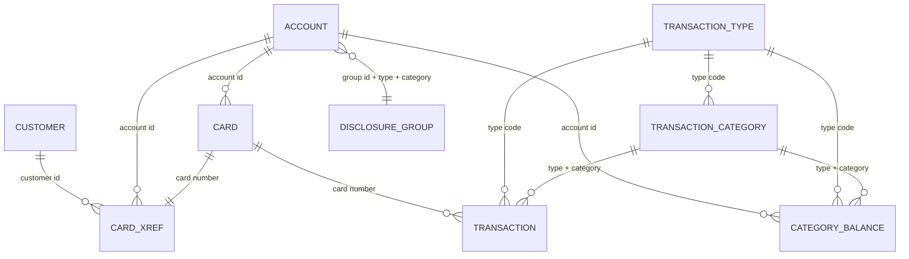

# 6. Domain data model

[← Batch processing](05-Batch-Processing.md) · [Home](Home.md) · [Optional modules →](07-Optional-Modules-and-Integrations.md)

## Logical relationship model



The relationship model is derived from file keys and program lookups; VSAM does not declare foreign-key constraints. Physical layouts and byte positions are normative in [File and Record Layouts](Appendix-File-and-Record-Layouts.md#core-indexed-files).

## Core entity catalog

| Entity | Identity | Owned state | Referenced by | Primary evidence |
|---|---|---|---|---|
| Customer | nine-character customer ID | names, three address lines, region/postal data, phones, SSN, government ID, DOB, EFT ID, primary-holder flag, FICO | card cross-reference, account screen, statement | [`CVCUS01Y.cpy`](../Old_Cobol_Code/app/cpy/CVCUS01Y.cpy#L4-L23) |
| Account | eleven-character account ID | status, current balance, limits, lifecycle dates, current-cycle accumulators, ZIP, disclosure group | card, cross-reference, posting, interest, bill payment, screens, statements | [`CVACT01Y.cpy`](../Old_Cobol_Code/app/cpy/CVACT01Y.cpy#L4-L17) |
| Card | sixteen-character card number | account ID, CVV, embossed name, expiration, status | cross-reference, transaction, card screens | [`CVACT02Y.cpy`](../Old_Cobol_Code/app/cpy/CVACT02Y.cpy#L4-L11) |
| Card cross-reference | card number | customer ID and account ID | nearly every account/card/transaction workflow | [`CVACT03Y.cpy`](../Old_Cobol_Code/app/cpy/CVACT03Y.cpy#L4-L8) |
| Transaction | sixteen-character transaction ID | type/category, source, description, amount, merchant, card, original and processing timestamps | online list/view, posting, interest, reports, statements | [`CVTRA05Y.cpy`](../Old_Cobol_Code/app/cpy/CVTRA05Y.cpy#L4-L18) |
| Transaction type | two-character code | 50-character description | transaction display/reporting and optional Db2 maintenance | [`CVTRA03Y.cpy`](../Old_Cobol_Code/app/cpy/CVTRA03Y.cpy#L4-L7) |
| Transaction category | type plus four-character numeric category | 50-character description | transaction display/reporting | [`CVTRA04Y.cpy`](../Old_Cobol_Code/app/cpy/CVTRA04Y.cpy#L4-L9) |
| Category balance | account + type + category | accumulated signed amount | posting and interest | [`CVTRA01Y.cpy`](../Old_Cobol_Code/app/cpy/CVTRA01Y.cpy#L4-L10) |
| Disclosure rate | group + type + category | signed annual rate with two decimals | interest | [`CVTRA02Y.cpy`](../Old_Cobol_Code/app/cpy/CVTRA02Y.cpy#L4-L10) |
| Security user | eight-character user ID | first/last name, eight-character password, role | sign-on and admin CRUD | [`CSUSR01Y.cpy`](../Old_Cobol_Code/app/cpy/CSUSR01Y.cpy#L17-L23) |

## Identity and relationship rules

### Card, account and customer resolution

The cross-reference is the bridge among the three customer-domain identifiers. Its primary key is card number and its non-unique alternate key is account ID ([`XREFFILE.jcl` lines 39–92](../Old_Cobol_Code/app/jcl/XREFFILE.jcl#L39-L92)). Batch posting resolves `transaction.card → xref.account → account`; an unknown card is reject reason 100 and an unknown resolved account is reason 101 ([`CBTRN02C.cbl` lines 380–400](../Old_Cobol_Code/app/cbl/CBTRN02C.cbl#L380-L400)).

`CARD-ACCT-ID` duplicates the account relationship stored by cross-reference. No source routine globally reconciles these values. The .NET database must enforce equality on create/update/import or deliberately support inconsistent legacy fixtures under a compatibility flag.

Transactions do not contain account or customer IDs. Those are always derived through card cross-reference. Removing or changing a cross-reference therefore changes how historical transactions resolve. This is a parity fact and a target data-integrity risk.

### Transaction reference identity

The transaction-category key is `(type code, category code)`, not category alone. Category codes repeat across types. The transaction-category-balance key adds account ID; the disclosure-rate key adds account group. Any .NET lookup keyed only by category would be incorrect.

### User identity and roles

Only role codes `A` and `U` are named by the shared communication area ([`COCOM01Y.cpy` lines 25–31](../Old_Cobol_Code/app/cpy/COCOM01Y.cpy#L25-L31)). The fixture contains five administrators and five regular users. Role-specific navigation is defined in [Security and Controls](08-Security-and-Controls.md#authorization-matrix).

## Monetary state transitions

### Daily posting

For an accepted daily transaction, `CBTRN02C` performs three mutations in order:

1. Create or increment category balance by transaction amount.
2. Add amount to account current balance. For a nonnegative amount, add it to current-cycle credit; for a negative amount, add the negative value to current-cycle debit.
3. Write the transaction master record with the original timestamp and a newly generated processing timestamp.

Evidence: [`CBTRN02C.cbl` lines 424–442 and 467–579](../Old_Cobol_Code/app/cbl/CBTRN02C.cbl#L424-L442). There is no encompassing transaction/rollback in this batch program. A later failure can leave earlier files updated; strict parity tests must characterize the order, while the safe .NET target should commit all three changes atomically.

Before those mutations, the credit-limit test calculates:

```text
temporary balance = current-cycle credit - current-cycle debit + incoming amount
accept if credit limit >= temporary balance
```

Because debit is populated by adding negative transaction amounts, subtracting it increases the temporary balance. This is the implemented arithmetic, even if a different accounting convention might be expected. Expiration validation runs afterward and overwrites reason 102 with reason 103 if both fail ([`CBTRN02C.cbl` lines 393–420](../Old_Cobol_Code/app/cbl/CBTRN02C.cbl#L393-L420)).

### Interest calculation

For every category-balance record with a nonzero applicable rate:

```text
monthly interest = category balance * annual rate / 1200
account interest = sum(monthly interest across the account)
```

The calculation writes one type `01`, category `0005` system transaction per nonzero-rate category, adds accumulated interest to account current balance, and resets both cycle accumulators to zero ([`CBACT04C.cbl` lines 188–221 and 350–354](../Old_Cobol_Code/app/cbl/CBACT04C.cbl#L188-L221), [`CBACT04C.cbl` lines 462–500](../Old_Cobol_Code/app/cbl/CBACT04C.cbl#L462-L500)). Fee calculation is a source placeholder and performs no work ([`CBACT04C.cbl` lines 518–520](../Old_Cobol_Code/app/cbl/CBACT04C.cbl#L518-L520)).

If a group-specific rate is absent, file status 23 triggers lookup with group ID `DEFAULT` ([`CBACT04C.cbl` lines 415–459](../Old_Cobol_Code/app/cbl/CBACT04C.cbl#L415-L459)). In the supplied 300-byte account fixtures every parsed group field is blank and `A000000000` occupies the preceding ZIP field. Consequently the fixture follows the `DEFAULT` rate path. This is confirmed by fixed offsets, not inferred from the apparent value label.

The legacy loop fails to rewrite the final account at end-of-file even though its interest transactions have already been written. That quirk is tracked under [Interest final-account update](14-Known-Defects-and-Open-Decisions.md#interest-final-account-update).

### Online-created transactions

Transaction-add and bill-payment workflows write directly to the transaction store rather than to the daily input file. Their exact validation, ID construction and account mutation rules are specified in [Online Screens and Navigation](04-Online-Screens-and-Navigation.md#transaction-add) and [Bill payment](04-Online-Screens-and-Navigation.md#bill-payment).

## State and code values observed in fixtures

The fixture transaction types are reference data, not hard-coded validation enums:

| Code | Description |
|---|---|
| `01` | Purchase |
| `02` | Payment |
| `03` | Credit |
| `04` | Authorization |
| `05` | Refund |
| `06` | Reversal |
| `07` | Adjustment |

There are 18 supplied `(type, category)` rows; the full descriptions are in [`trancatg.txt`](../Old_Cobol_Code/app/data/ASCII/trancatg.txt). Interest uses `(01,0005)`, whose fixture description is “Interest Amount.” Bill payment uses the source-defined values documented on its workflow page.

Account/card active status and primary-card-holder indicator are one-character fields. Their allowed values must come from each mutation program’s validations; the layout and fixture alone do not prove a universal enum.

## Source-level integrity gaps

The following are observed gaps, not assumptions:

- No foreign-key engine protects VSAM relationships.
- The same account relationship is stored in card and cross-reference records.
- Transactions depend on a mutable cross-reference for account/customer resolution.
- Core online multi-file updates do not consistently establish one atomic unit of work.
- The account update output layout omits `ACCT-ADDR-ZIP`, shifts group ID into ZIP, and blanks the true group bytes. See [Account update layout shift](14-Known-Defects-and-Open-Decisions.md#account-update-layout-shift).
- The ASCII cross-reference fixture omits the 14-byte filler, while EBCDIC records contain it.
- Account fixture data places `A000000000` in ZIP and leaves group blank despite disclosure data containing an `A000000000` group.

## .NET 10 target persistence model

**Target recommendation:** use a relational store behind repository interfaces, with SQLite as the self-contained default for the console product and provider substitution possible without changing domain services. Preserve legacy identifiers as fixed maximum-length strings and money/rates as `decimal`.

Recommended tables and keys:

| Table | Key / important constraint |
|---|---|
| `Users` | `UserId`; role check `A/U`; password hash rather than legacy plaintext |
| `Customers` | `CustomerId` |
| `Accounts` | `AccountId`; concurrency token |
| `Cards` | `CardNumber`; FK account; unique `(CardNumber, AccountId)` relationship |
| `CardCrossReferences` | `CardNumber`; FKs customer/account; index account |
| `Transactions` | `TransactionId`; FK card; indexes card and processing timestamp |
| `TransactionTypes` | `TypeCode` |
| `TransactionCategories` | `(TypeCode, CategoryCode)` |
| `CategoryBalances` | `(AccountId, TypeCode, CategoryCode)` |
| `DisclosureRates` | `(GroupId, TypeCode, CategoryCode)` |
| `BatchRuns` / `BatchRejects` | generated run ID; reject keeps original 350 bytes plus reason |

The import/export layer must retain raw filler and original byte payload when byte-for-byte re-export is in scope. Normalized tables alone cannot reproduce unknown filler content. See [.NET target component model](09-DotNet-Target-Architecture.md#target-component-model) for transaction boundaries and adapters.

---

[← Batch processing](05-Batch-Processing.md) · [Home](Home.md) · [Optional modules →](07-Optional-Modules-and-Integrations.md)

