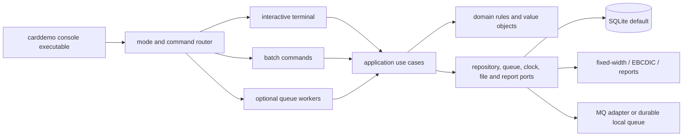

# 9. .NET 10 console target architecture

[← Security and controls](08-Security-and-Controls.md) · [Home](Home.md) · [Implementation plan →](10-Implementation-Plan.md)

## Target constraints

This page is a **target recommendation**, not a description of the COBOL runtime.

The replacement is one deployable **.NET 10 console application**:

- SDK-style executable project with `TargetFramework` `net10.0` and `OutputType` `Exe`.
- No ASP.NET Core host, HTTP endpoint, browser UI, desktop GUI, or hidden web dependency.
- Interactive terminal mode reproduces CICS screen workflows.
- Non-interactive command modes reproduce JCL programs, utilities, reports, import/export and workers.
- Runs on Windows or Linux with redirected-input/output behavior defined separately from an interactive TTY.
- One domain/application layer is shared by interactive and batch modes so rules are not duplicated.

[.NET 10 is an LTS release](https://learn.microsoft.com/en-us/dotnet/core/whats-new/dotnet-10/overview). EF Core 10 also requires .NET 10 and is LTS ([Microsoft EF Core 10 release notes](https://learn.microsoft.com/en-us/ef/core/what-is-new/ef-core-10.0/whatsnew)). Exact SDK and package patch versions should be centrally pinned when implementation starts; this specification intentionally does not invent a future patch number.

## Target component model



### Layer responsibilities

| Layer/project | Responsibility | Must not contain |
|---|---|---|
| `CardDemo.Console` | Generic Host setup, mode routing, terminal rendering/input, process exit code | business calculations, SQL, binary record parsing |
| `CardDemo.Application` | use cases, orchestration, validation ordering, transaction boundaries, result models | direct `Console` calls, provider-specific SQL |
| `CardDemo.Domain` | identifiers, entities, money/rate arithmetic, pure rules and compatibility policies | EF attributes, files, clocks, queues |
| `CardDemo.Infrastructure` | EF Core, SQLite, fixed-width/EBCDIC codecs, report writers, queue adapters, system clock | screen navigation rules |
| test projects | characterization, unit, integration, end-to-end console and golden-file tests | production-only shortcuts |

All projects target `net10.0`; the class libraries are implementation organization, not additional deployed products. Publish produces one console entry point plus its runtime dependencies, or a single-file bundle if platform testing approves it.

## Process startup and lifetime

Use `Host.CreateApplicationBuilder(args)`. Microsoft recommends `IHostApplicationBuilder` for new projects, and the Generic Host supplies dependency injection, configuration, logging, shutdown and hosted-service lifetime to console apps ([Generic Host documentation](https://learn.microsoft.com/en-us/dotnet/core/extensions/generic-host)).

Minimal project intent:

```xml
<Project Sdk="Microsoft.NET.Sdk">
  <PropertyGroup>
    <OutputType>Exe</OutputType>
    <TargetFramework>net10.0</TargetFramework>
    <ImplicitUsings>enable</ImplicitUsings>
    <Nullable>enable</Nullable>
    <TreatWarningsAsErrors>true</TreatWarningsAsErrors>
  </PropertyGroup>
</Project>
```

Startup sequence:

1. Create the host builder and load configuration.
2. Bind and validate typed options before touching data.
3. Register clock, repositories, unit of work, codecs, report writers, queue adapters and terminal abstraction.
4. Build the host and create one command scope.
5. Parse the product command, invoke exactly one mode, and propagate cancellation from `Ctrl+C`.
6. Flush logs, dispose the scope/host, and return the documented process exit code.

Interactive mode is not an endless `BackgroundService`; it is a scoped command that owns the terminal until sign-off. Long-lived optional MQ processors use a hosted-service mode and honor graceful cancellation.

## Console command surface

Command names are target contracts. Aliases may be added, but scripts use the stable names below.

```text
carddemo interactive

carddemo database initialize [--seed <fixture-root>]
carddemo database migrate
carddemo database verify

carddemo batch refresh-masters --fixture-root <path>
carddemo batch post-transactions --input <path> --rejects <path>
carddemo batch calculate-interest --cycle-id <10-char-value>
carddemo batch combine-transactions
carddemo batch rebuild-transaction-index
carddemo batch generate-statements --text <path> --html <path>
carddemo batch generate-report --from <yyyy-MM-dd> --to <yyyy-MM-dd> --output <path>
carddemo batch full-cycle --profile <name>
carddemo batch run-pending-reports

carddemo transfer export-branch --output <path>
carddemo transfer import-branch --input <path> --error-output <path>

carddemo authorization process
carddemo authorization purge-expired
carddemo worker authorization
carddemo worker account-inquiry
carddemo worker system-date
```

Every non-interactive command supports `--help`, rejects unknown options, writes human diagnostics to standard error, and emits primary output to the requested file or standard output. Automation must not depend on ANSI control sequences.

### Exit-code contract

| Code | Target meaning | Legacy basis |
|---:|---|---|
| 0 | completed successfully | normal COBOL/JCL completion |
| 2 | command-line/configuration error | target-only conventional usage failure |
| 4 | completed with business rejects or nonfatal validation findings | posting sets return code 4 when rejects exist ([`CBTRN02C.cbl` lines 227–231](../Old_Cobol_Code/app/cbl/CBTRN02C.cbl#L227-L231)) |
| 8 | requested resource/state unavailable | target mapping for recoverable operational failure |
| 12 | fatal data/I/O/integration failure | legacy programs map many unexpected file statuses to application result 12 before abend |
| 130 | cancelled by operator | target shell contract |

Exact scheduler success thresholds are specified in [Operations and Deployment](12-Operations-and-Deployment.md#exit-codes-and-retries). Exceptions never leak secrets or full sensitive records to the terminal.

## Interactive terminal design

The default viewport is the BMS-compatible 24 rows × 80 columns. `IConsoleTerminal` exposes dimensions, cursor placement, color/attribute intent, masked input, field editing, key input, clearing and output. Production uses `System.Console`; tests use a deterministic virtual terminal.

The screen controller maintains an explicit `SessionContext` corresponding to the useful content of `CARDDEMO-COMMAREA`: authenticated user/role, current customer/account/card, previous and next route, and re-entry context ([`COCOM01Y.cpy` lines 19–44](../Old_Cobol_Code/app/cpy/COCOM01Y.cpy#L19-L44)). It must not serialize COBOL padding into the new session.

Each legacy BMS map becomes:

- immutable screen metadata (title, labels, field coordinates and widths);
- a view model containing display values, field errors and message;
- a controller/use case for keys, validation and navigation;
- a renderer that clips/pads to exact field length;
- virtual-terminal snapshots for 24×80 golden tests.

Function-key mapping follows [Online Screens and Navigation](04-Online-Screens-and-Navigation.md#key-contract). On terminals that cannot produce an F-key, textual commands such as `/pf3` are target accessibility aliases; they do not replace the displayed legacy key.

When input or output is redirected, `interactive` fails with exit 2 and explains that a TTY is required. Batch commands remain fully redirectable.

## Persistence design

### Default store

Use EF Core 10 with the Microsoft-maintained `Microsoft.EntityFrameworkCore.Sqlite` provider ([provider documentation](https://learn.microsoft.com/en-us/ef/core/providers/sqlite/)). The default database is a configurable local file, suitable for the requested self-contained console product. Repository interfaces and provider-neutral mappings preserve a path to a server database if concurrent deployment later requires it.

SQLite does not natively support comparison/ordering for EF `decimal` mappings and has migration/concurrency limitations ([official limitations](https://learn.microsoft.com/en-us/ef/core/providers/sqlite/limitations)). Therefore:

- domain code uses `decimal` for calculations;
- currency persists as signed 64-bit minor units (cents) through a converter;
- disclosure rates persist as signed integer hundredths of a percent;
- timestamps that must reproduce the legacy string retain a canonical 26-character text representation alongside any parsed UTC value;
- IDs remain strings, never generated integers;
- explicit `database migrate` is used in production rather than racing automatic startup migrations.

### Units of work

The safe-target default wraps each logical mutation in one database transaction. EF Core guarantees atomicity for changes in one `SaveChanges` call when its provider supports transactions; explicit transactions cover multi-save workflows ([EF Core transaction documentation](https://learn.microsoft.com/en-us/ef/core/saving/transactions)).

| Use case | Safe-target transaction boundary |
|---|---|
| account update | account + customer + related values together |
| card update | verified card/account relationship + card change |
| transaction add | validation + transaction insert |
| bill payment | payment transaction + account balance/cycle state |
| posting one input record | category balance + account + transaction or reject record |
| interest per account | all interest transactions + account update/reset |
| pending authorization decision | request state + history/fraud state + reply/outbox |

Strict legacy characterization can execute an in-memory compatibility orchestrator that exposes mutation order and fault injection, but production must not intentionally partially commit merely to preserve a defect. Every corrected boundary is a decision in [Known Defects and Open Decisions](14-Known-Defects-and-Open-Decisions.md#atomicity-policy).

### Concurrency

Use optimistic concurrency on account, card, user, category balance and authorization rows. The interactive controller reloads and reports a conflict instead of silently overwriting. Batch commands take a database-scoped application lock row so two posting/full-cycle commands cannot run concurrently. SQLite is a single-node default; multi-process high-write deployment requires a server provider decision.

## File and encoding adapters

Four distinct codecs are required:

1. Fixed-width ASCII/display records with overpunch support.
2. EBCDIC code-page records with signed display numerics.
3. Mixed `COMP`/`COMP-3`/display 500-byte export records using explicit big-endian binary and packed-decimal codecs.
4. Line reports/statements with exact 80/100/133-character output modes.

Every codec accepts/returns spans or streams, validates exact record length, reports record number and field on failure, and never trims identifiers implicitly. A `--strict-layout` option rejects short filler; compatibility import may right-pad the known 36-character ASCII cross-reference fixture. Layouts are in [File and Record Layouts](Appendix-File-and-Record-Layouts.md#storage-conventions).

## Configuration contract

The Generic Host loads JSON, environment variables and command-line configuration; later providers override earlier ones ([Microsoft configuration guidance](https://learn.microsoft.com/en-us/dotnet/core/extensions/configuration)). Add a `CARDDEMO_` environment prefix, using double underscores for hierarchy.

| Section | Required examples | Sensitive? |
|---|---|---:|
| `Data` | provider, connection string/database path, command timeout | connection string may be |
| `Files` | fixture root, working root, reports, rejects, archive | no |
| `Compatibility` | strict legacy switches, date semantics, filler preservation | no |
| `Terminal` | 24×80 enforcement, color, textual F-key aliases | no |
| `Batch` | lock timeout, report page size, run profile | no |
| `Authorization` | expiry policy, queue names, worker poll interval | queue credentials are |
| `Mq` | queue manager/channel/queue names and TLS settings | credentials/cert paths are |
| `Security` | password-hash parameters, session timeout, redaction | secrets are |

Do not store passwords, MQ credentials or production connection secrets in committed `appsettings.json`. Validate all paths as rooted under configured data/output roots unless the operator explicitly opts into an external path.

## Time, culture and deterministic IDs

Inject `TimeProvider`; never call `DateTime.Now` inside domain/application services. Store operational instants in UTC, but reproduce legacy 10- and 26-character values with an explicit formatter. Interactive dates use the formats and range rules in the screen specification; batch `cycle-id` remains an exact ten-character input because the interest program concatenates it with a six-digit suffix to form a 16-character transaction ID.

All numeric parsing and formatting uses an explicit invariant/parity culture. Characterization tests freeze time and ID suffixes so golden files are repeatable.

## Queues and optional modules

The domain ports are `IAuthorizationRequestQueue`, `IAuthorizationReplyQueue`, `IInquiryQueue` and `IOutbox`. The self-contained default uses durable SQLite queue/outbox tables and worker commands. An IBM MQ adapter may be selected by configuration when interoperability with existing queues is required. MQ reason/completion codes are translated to typed integration errors, not exposed to domain rules.

IMS hierarchical records and Db2 tables become relational entities in the default store, but their message/data contracts remain those documented in [Optional Modules and Integrations](07-Optional-Modules-and-Integrations.md#integration-data-contracts).

## Logging, audit and observability

Use structured `ILogger` events with stable event IDs. Each command creates correlation ID and, for batch, batch-run ID. Record start/end, counts, elapsed time, input/output identity, reject counts, and sanitized failures. Never log password, CVV, SSN, government ID, full EFT ID, raw authorization payload, or full customer/card records.

Business audit rows are separate from operational logs:

- user add/update/delete and role change;
- account/card update with actor and redacted field list;
- bill payment and transaction creation;
- report request;
- authorization/fraud decision;
- import/export and batch run summary.

## Compatibility profiles

| Profile | Purpose | Default? |
|---|---|---:|
| `Safe` | preserves intended features and data formats while fixing security, atomicity, bounds and known control-flow defects | Yes |
| `StrictLegacy` | enables individually named quirks only for characterization and migration comparison | No |

There is no single `EnableAllBugs` switch. Each quirk is named, documented and testable, for example `Report.DuplicateFinalAmount`, `Interest.SkipFinalAccountRewrite`, or `AccountUpdate.LegacyShiftedLayout`. Security weaknesses such as plaintext password storage are never enabled by a compatibility profile.

## Architecture acceptance criteria

- `dotnet build` and `dotnet test` run against .NET 10 with centrally pinned dependencies.
- Only `CardDemo.Console` is executable; no web listener starts.
- Every command can be constructed through dependency injection and tested without the physical console/system clock.
- Interactive golden screens fit 24×80 and all navigation paths have automated tests.
- Fixture import and branch export pass byte/field-level golden tests.
- Posting fixture produces the documented strict-parity oracle and an atomic safe-mode result.
- Fatal failures return defined exit codes and leave no partially committed safe-mode unit of work.
- Secrets and regulated fields are absent from logs and error output.

---

[← Security and controls](08-Security-and-Controls.md) · [Home](Home.md) · [Implementation plan →](10-Implementation-Plan.md)

