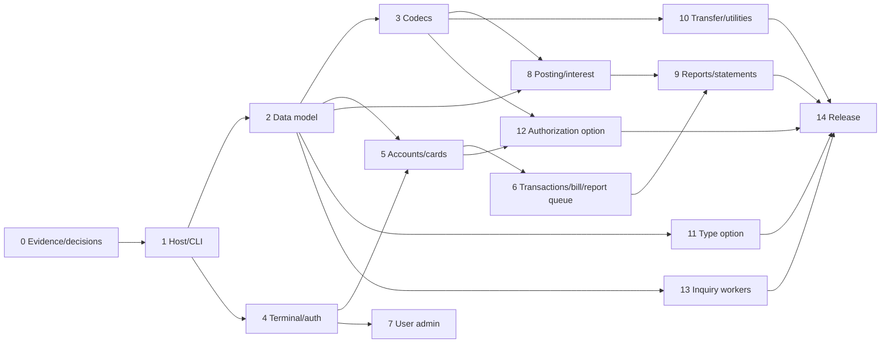

# 10. Implementation plan

[<- .NET target architecture](09-DotNet-Target-Architecture.md) | [Home](Home.md) | [Test plan ->](11-Test-and-Acceptance-Plan.md)

## Delivery principles

This plan builds the replacement from verified contracts in this wiki. It does not translate COBOL statements one-for-one. Each slice first establishes a characterization test from source evidence, implements the shared domain/use case, then attaches console, persistence and codec adapters. A slice is not complete until its requirement and tests are linked in [Traceability](13-Traceability-and-Coverage.md#requirements-to-tests).

Rules for every slice:

1. Target `net10.0`; keep exactly one executable project.
2. Implement the `Safe` profile as production default and an individually named strict behavior only where the test plan requires it.
3. Keep parsing/rendering outside domain entities; raw bytes and normalized values are different types.
4. Inject time, terminal, storage, filesystem and queue boundaries.
5. Apply database changes through reviewed migrations; never edit a production database manually.
6. Resolve or explicitly defer relevant items in the [decision register](14-Known-Defects-and-Open-Decisions.md#decision-register) before accepting a slice.

## Proposed solution structure

The names below are a target recommendation. All projects target `net10.0`.

```text
New_Dotnet_Code/
  CardDemo.slnx
  Directory.Build.props
  Directory.Packages.props
  global.json
  src/
    CardDemo.Console/
    CardDemo.Application/
    CardDemo.Domain/
    CardDemo.Infrastructure/
  tests/
    CardDemo.Domain.Tests/
    CardDemo.Application.Tests/
    CardDemo.Infrastructure.Tests/
    CardDemo.Console.Tests/
    CardDemo.Characterization.Tests/
  fixtures/
    manifests/
    expected/
```

`CardDemo.Console` is the only executable. Class libraries are organizational boundaries in the same delivered application. Package patch versions and SDK patch are centrally pinned when implementation begins; this documentation does not guess versions that are not present in the source.

### Core abstractions to establish first

| Boundary | Interface intent | Test substitute |
|---|---|---|
| terminal | dimensions, cursor/attributes, masked field input, key events, redirected-stream detection | 24x80 virtual terminal |
| clock/IDs | UTC/local legacy formatting and deterministic transaction identifiers | frozen `TimeProvider`, deterministic allocator |
| unit of work | atomic use-case commit and optimistic concurrency | rollback/fault-injection store |
| repositories | typed entity/query operations and keyset paging | SQLite in-memory/file test database |
| fixed record codecs | encode/decode exact bytes with field/record diagnostics | supplied ASCII/EBCDIC/golden byte arrays |
| report writers | fixed text, safe HTML and strict HTML modes | memory stream/golden files |
| filesystem | validated roots, atomic replacement/archive | temporary isolated directory |
| queues/outbox | durable receive, claim, complete, reply and retry | SQLite queue/outbox fake clock |
| logging/audit | structured redacted operational and business events | captured event sink |

## Delivery slices

### Slice 0 - decision and evidence baseline

Deliverables:

- approve core/optional first-release profile, persistence provider, required MQ compatibility and strict-output scope;
- capture the 329-artifact inventory hash ledger and fixture files as immutable test inputs;
- convert the fixture oracle in [Batch Processing](05-Batch-Processing.md#deterministic-fixture-oracle) into machine-readable expected values;
- establish requirement/test/source traceability and defect dispositions;
- pin .NET 10 SDK and package versions after confirming the supported build environment.

Exit gate: no undocumented product assumption remains on the critical path. Open decisions may be deferred only when the dependent slice is also deferred.

### Slice 1 - build, host and command shell

Implement the solution structure, nullable/warnings policy, Generic Host, configuration validation, dependency injection, structured logging, cancellation, help, command parser and exit codes. Initially commands may report “not implemented” with code 8, but all documented names must parse deterministically.

Exit gate:

- clean build and unit-test run on pinned .NET 10 SDK;
- one executable, no network listener;
- configuration precedence and secret redaction tests;
- `--help`, unknown option, redirected I/O, Ctrl+C and each exit code tested.

### Slice 2 - domain model and default persistence

Implement identifiers/value objects, money/rates, entities/relationships, repository ports, EF Core mappings, SQLite migrations, application lock, optimistic concurrency, audit store and `database initialize/migrate/verify` commands. Use integer cents in SQLite as required by [Persistence Design](09-DotNet-Target-Architecture.md#default-store).

Exit gate:

- every entity/key/relationship in [Domain Data Model](06-Domain-Data-Model.md#core-entity-catalog) mapped;
- schema round-trip and migration rollback/upgrade tests;
- duplicate/inconsistent relationship and concurrency tests;
- atomic multi-entity fault-injection tests.

### Slice 3 - file and fixture codecs

Implement fixed display ASCII, EBCDIC, signed overpunch, big-endian binary, COMP-3, variable/fixed line and 500-byte transfer codecs. Import supplied fixtures into the default database with provenance and build byte-for-byte round trips wherever filler is available.

Work record by record from [File and Record Layouts](Appendix-File-and-Record-Layouts.md#layout-index); do not create a generic substring parser that silently pads every record.

Exit gate:

- exact length/offset/property tests for every layout;
- invalid sign/nibble/encoding/short/long-record tests name record and field;
- ASCII and EBCDIC equivalent logical records compare equal;
- known 36-byte ASCII xref compatibility is explicit, not general truncation;
- export header and each payload type round-trip golden bytes.

### Slice 4 - authentication and terminal framework

Implement virtual/physical terminal, map metadata, renderer, input clipping, field attributes, cursor/error priority, `SessionContext`, route state machine, sign-on, sign-off and main/admin menus. Import legacy users by a controlled one-time password migration path.

Exit gate:

- all sign-on successes/failures and role routes pass;
- 24x80 snapshots match field coordinates/lengths;
- password never appears in screen snapshot/log/store after migration;
- direct construction of an admin route as a regular user is denied;
- every F3/Enter/menu option and optional-module-unavailable result passes.

### Slice 5 - account and card use cases

Implement account view/update and card list/view/update with source validation order, exact widths, keyset pagination, optimistic concurrency and safe atomicity. Keep strict layout/card quirks in test-only named policies.

Exit gate: all `FR-ACCT-*` and `FR-CARD-*` tests, including calendar/leap, literal validation tables, paging boundaries, account/card ownership, CVV preservation, conflict and rollback cases.

### Slice 6 - transaction, bill payment and report-request use cases

Implement transaction list/detail/add, unique ID allocator, bill payment, report request validation/confirmation and durable pending-report queue. Do not execute embedded legacy JCL.

Exit gate:

- all `FR-TRAN-*`, `FR-BILL-*`, `FR-RPT-001`-`003` paths pass;
- concurrent add/payment cannot duplicate IDs or double-pay;
- validation error cannot be confirmed into a write;
- report request holds normalized parameters, actor and correlation ID and is restart-safe.

### Slice 7 - security-user administration

Implement list/add/update/delete with normalized IDs, hashed credentials, `A/U` validation, explicit save/return/delete confirmation, final-admin/self-delete guards, concurrency and audit.

Exit gate: all `FR-USER-*` and authorization-matrix tests, including direct command/controller invocation by an unauthorized role.

### Slice 8 - core batch posting and interest

Implement run ledger, input fingerprint/idempotency, locks, reject writer, posting orchestration, interest orchestration, category/account mutations, strict source arithmetic and safe atomic boundaries. Freeze clock and use the supplied dataset first.

Exit gate:

- exact posting fixture result: 262 accepted, 38 reason-102 rejects, and documented totals;
- strict interest result including the source final-account omission, plus safe result that updates it;
- record-level crash/retry tests at every write boundary;
- exit 4 for business rejects and fatal codes for structural/I/O failure.

### Slice 9 - reports, statements and transaction maintenance

Implement combine/rebuild, dated transaction report, text statement and HTML statement commands. Preserve strict fixed-record modes, while safe mode fixes EOF, bounds and HTML defects. Consume pending report requests atomically.

Exit gate:

- strict supplied fixture counts: 50 text, 50 HTML, 312 detail rows, and documented record counts/widths;
- report range/sort/page/total golden tests including empty/single/final-account cases;
- HTML injection/escaping and more-than-ten-transactions tests;
- claimed report requests complete once or return to retry state.

### Slice 10 - branch import/export and remaining utilities

Implement snapshot export, validated transactional import, error records, diagnostic/read commands, master refresh, full-cycle orchestration, archive/working paths and database verification.

Exit gate:

- 500-record supplied export composition and byte header/payload tests;
- corrupted/unknown/missing-output/duplicate import cases fail nonzero without partial data;
- refresh and full cycle can be rerun according to the approved replacement/restart policy;
- no command writes outside validated configured roots without explicit operator opt-in.

### Slice 11 - optional transaction-type module

Implement list/maintenance/batch input/extract/synchronization against the default relational store. Add a Db2 adapter only if interoperability is approved.

Exit gate: all `FR-OPT-001`-`004`, type/category foreign-key behavior, trimmed description lengths, concurrency, delete-reference behavior and optional-disabled routes.

### Slice 12 - optional authorization module

Implement versioned request/reply codecs, inbox/outbox, decision service, pending summary/history, fraud state, inquiry/detail screens, purge and load/unload. A local durable worker is default; add IBM MQ adapter only when required.

Exit gate: all `FR-OPT-005`-`013`, reason-code truth table, clean per-message state, duplicate delivery, crash before/after outbox, history paging, fraud toggle atomicity, purge/restart and sensitive-payload redaction tests.

### Slice 13 - optional inquiry/date workers

Implement account inquiry and date service codecs/workers, configured queues, correct reply correlation/destination, bounded retry/dead-letter behavior and graceful shutdown.

Exit gate: all `FR-OPT-014`-`017`, exact strict 1000-byte response goldens, invalid request, unknown account, duplicate delivery, queue failure and frozen-clock cases.

### Slice 14 - hardening and release

Run full parity, security, performance-envelope, failure/recovery, packaging and operations validation. Produce platform-specific publish artifacts and a software bill of materials. Exercise backup/restore and release rollback on a production-like copy.

Exit gate: every release criterion in [Test and Acceptance](11-Test-and-Acceptance-Plan.md#release-acceptance), every required operational runbook, no unresolved critical decision, and signed traceability report.

## Dependency order



Optional slices not selected for the first release may be omitted from that release gate, but their absence and navigation/command behavior must still be tested.

## Migration workflow

1. Take a read-consistent legacy extract and record file sizes, record counts and SHA-256 hashes.
2. Verify each input against its named codec without mutating the target database.
3. Load reference/master data in relationship order: users/reference data, customers/accounts, cards/xrefs, transactions, category balances/disclosures, optional data.
4. Produce reconciliation counts, keys, balance totals, referential exceptions and byte-level samples.
5. Convert credentials through the approved reset or one-time migration mechanism; never carry plaintext forward as normal state.
6. Freeze legacy writes or run a tested delta/cutover procedure; the source contains no change-data-capture contract, so a delta mechanism is a project decision.
7. Run characterization reports and compare both strict outputs and normalized business totals.
8. Switch operators/users to the console product, retain a rollback checkpoint and monitor audit/error/run ledgers.

## Engineering definition of done

For every pull request/slice:

- requirement IDs and source links are stated;
- tests include success, validation priority, not-found/duplicate, boundary, concurrency and injected failure as applicable;
- no production code reads system time/culture/console/filesystem directly across a port boundary;
- migrations/codecs are backward/round-trip tested;
- logs are inspected for sensitive values;
- documentation and traceability are updated in the same change;
- `dotnet format`/build/test/static analysis pass under the pinned SDK;
- changed command behavior is reflected in `--help` and operations runbooks.

## Prohibited shortcuts

- Do not use the apparent fixture text column as a field definition when it disagrees with copybook offsets.
- Do not translate each COBOL program into an isolated command with duplicate business rules.
- Do not use `double` for money/rates or numeric database IDs for fixed identifiers.
- Do not make SQLite schema on application startup in production without an explicit migration command.
- Do not swallow a source contradiction by selecting the more convenient interpretation.
- Do not enable plaintext credentials, missing authorization or non-atomic writes as “compatibility.”
- Do not treat a generated inventory entry as proof that its functionality has been implemented.

---

[<- .NET target architecture](09-DotNet-Target-Architecture.md) | [Home](Home.md) | [Test plan ->](11-Test-and-Acceptance-Plan.md)
